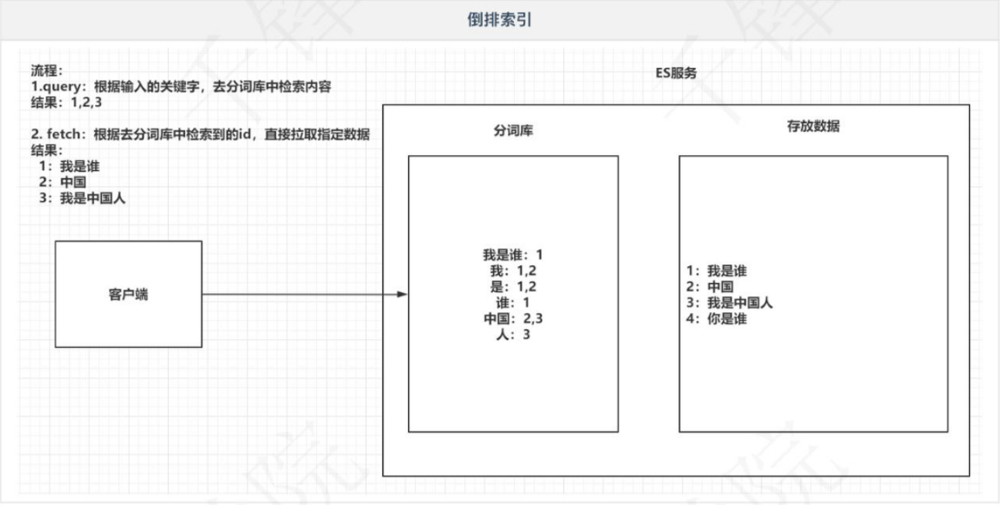
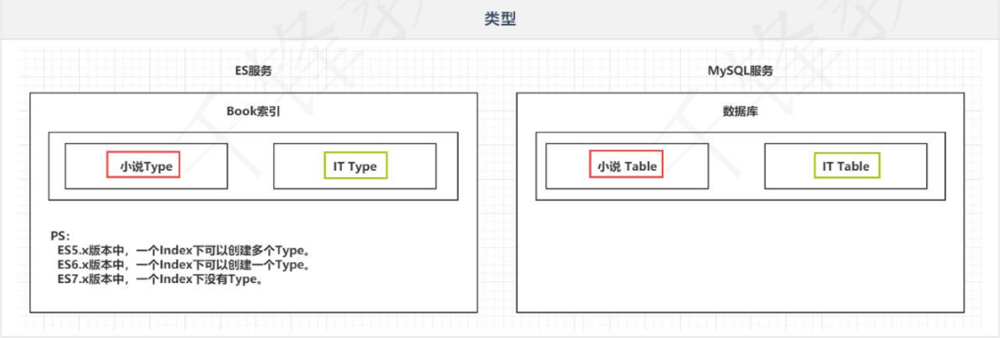

### ElasticSearch

#### 2.1.介绍

```
1.ES是一个使用Java语言并且基于Lucene编写的搜索引擎框架，他提供了分布式的全文搜索功能，提供了一个统一的基于RESTful风格的WEB接口，官方客户端也对多种语言都提供了相应的API。

2.Lucene: Lucene本身就是一个搜索引擎的底层。

3.分布式:ES主要是为了突出他的横向扩展能力。

4.全文检索:将一段词语进行分词，并且将分出的单个词语统一的放到一个分词库中，在搜索时，根据关键字去分词库中检索，找到匹配的内容。(倒排索引)

5.RESTful风格的WEB接口︰操作ES很简单，只需要发送一个HTTP请求，并且根据请求方式的不同，携带参数的同，执行相应的功能。

6.应用广泛:Github.com，WIKI,Gold Man用ES每天维护将近10TB的数据。
```


#### 2.2.与Solr对比

>Solr在查询死数据时，速度相对ES更快一些。但是数据如果是实时改变的，Solr的查询速度会降低很多，ES的查询的效率基本没有变化。
>
>Solr搭建基于需要依赖Zookeeper来帮助管理。ES本身就支持集群的搭建，不需要第三方的介入。
>
>最开始Solr的社区可以说是非常火爆，针对国内的文档并不是很多。在ES出现之后，ES的社区火爆程度直线上升，ES的文档非常健全。
>
>ES对现在云计算和大数据支持的特别好。


#### 2.3.倒排索引



```
将存放的数据，以一定的方式进行分词，并且将分词的内容存放到一个单独的分词库中。

当用户去查询数据时，会将用户的查询关键字进行分词。

然后去分词库中匹配内容，最终得到数据的id标识。

根据id标识去存放数据的位置拉取到指定的数据。
```


### 三、ElasticSearch安装

#### 3.1安装ES&Kibana

> ocker-compose.yml

在docker-compose.yml同目录下执行 `docker-compose up -d`

```yml
version: "3.1"
services: 
  elasticsearch: 
    image: daocloud.io/library/elasticsearch:6.5.4
    restart: always
    container_name: elasticsearch
    ports:
     - 9200:9200
  kibana: 
    image: daocloud.io/library/kibana:6.5.4
    restart: always
    container_name: kibana
    ports: 
     - 5601:5601
    environment: 
     - elasticsearch_url=http://192.168.181.22:9200
    depends_on:
     - elasticsearch
```


#### 3.2.安装IK分词器

>下载K分词器的地址: https:/[github.com/medcl/elasticsearch-analysis-ik/releases/download/v6.5.4/elasticsearch-analysis-ik-6.5.4.zip
>
>由于网络问题，采用国内的路径去下载: http:/tomcato1.qfjava.cn:31/elasticsearch-analysis-ik-6.5.4.zip
>进去到ES容器内部，跳转到bin目录下，执行bin目录下的脚本文件: ./elasticsearch-plugin install http://tomcat01.qfjava.cn:81/elasticsearch-analysis-ik-6.5.4.zip
>
>重启ES的容器，让Ik分词器生效。

```
# 测试IK分词器
POST _analyze 
{
  "analyzer": "ik_max_word",
  "text": "千锋教育"
}
```


### 四、ElasticSearch基本操作

#### 4.1 ES的结构

##### 4.1.1 索引Index，分片和备份

>- ES的服务中,可以创建多个索引。每一个索引默认被分成5片存储
>- 每一个分片都会存在至少一个备份分片
>- 备份分片默认不会帮助检索数据，当ES检索压力特别大的时候，备份分片才会帮助检索数据
>- 备份的分片必须放在不同的服务器中


##### 4.1.2 类型 Type

>一个索引下，可以创建多个类型。
>Ps:根据版本不同，类型的创建也不同。




##### 4.1.3 文档 Doc

> 一个类型下，可以有多个文档。这个文档就类似于MySQL表中的多行数据。


##### 4.1.4 属性 Filed

> 一个文档中，可以包含多个属性。类似于MySQL表中的一行数据存在多个列。


#### 4.2 操作ES的RESTful语法

>- GET请求:
>  - ip:port/index：查询索引信息
>    ip:port/index/type/doc_id：查询指定的文档信息
>- POST请求:
>  - ip:port/index/type/_ search：查询文档，可以在请求体中添加json字符串来代表查询条件
>  - ip:port/index/type/doc_ id/_update：修改文档，在请求体中指定json字符串代表修改的具体信息
>- PUT请求:
>  - ip:port/index： 创建一个索引，需要在请求体中指定索引的信息，类型，结构
>  - ip:port/index/type/_ mappings：代表创建索引时，指定索引文档存储的属性的信息
>- DELETE请求:
>  - ip:port/index：删除索引
>  - ip:port/index/type/doc_ id：删除指定的文档


#### 4.3 索引的操作

##### 4.3.1 创建一个索引

> 语法如下

```js
# 创建一个索引
PUT /person
{
    "settings": {
    	"number of_ shards": 5,
    	"number_ of_ replicas": 1
    }
}
```


##### 4.3.2 查看索引信息

> 语法如下

```js
# 查看索引
GET /person
```


##### 4.3.3 删除索引

> 语法如下

```js
# 删除索引
DELETE /person
```

