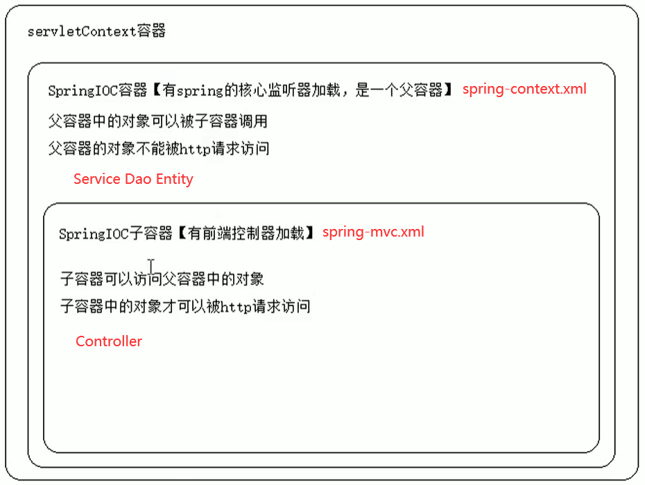

### Spring面试题

参考：[Spring面试题](https://blog.csdn.net/a745233700/article/details/80959716)  [Spring Bean作用域](https://blog.csdn.net/qq_41083009/article/details/90743719)  [Spring源码分析](https://blog.csdn.net/nuomizhende45/article/details/81158383)  [Spring 中的观察者模式](https://www.cnblogs.com/dubhlinn/p/10725636.html))


参考： [IOC容器结构](https://www.bilibili.com/video/BV1EE411u7YV?p=26)  [IOC父子容器](https://blog.csdn.net/fhjdzkp/article/details/78687513)

```
例如：
我们事务注解支持(<tx:annotation-driven/>)放入了spring-context.xml，它的注解范围在service dao以及entity；
如果将事务注解支持放入spring-mvc.xml，事务注解(@Transaction)放在service上无效.

又或者，我们共有三个文件spring-context.xml、spring-security.xml、spring-mvc.xml，spring-context.xml引入了spring-security.xml
如果想启用security注解权限的配置，在controller生效，应放入spring-mvc.xml
如果想启用security注解权限的配置，在service、dao、entity生效，应放入spring-context.xml或者spring-security.xml
```



#### IOC基本原理

```java
1、IOC 思想基于 IOC 容器完成，IOC 容器底层就是对象工厂
2、Spring 提供 IOC 容器实现两种方式：（两个接口）
	1).BeanFactory：IOC 容器基本实现，是 Spring 内部的使用接口，不提供开发人员进行使用
	* 加载配置文件时候不会创建对象，在获取对象（使用）才去创建对象
	
	2).ApplicationContext：BeanFactory 接口的子接口，提供更多更强大的功能，一般由开发人员进行使用
	* 加载配置文件时候就会把在配置文件对象进行创建
	
	虽然第一种方式比较好，但我们通常是Web项目，在项目启动时加载时全部加载，后期访问更快，费时费力放在启动
	
String classValue = class属性;//xml解析得到
Class class = Class.forName(className);//通过反射创建对象
User user = (User)class.newInstance();//创建实例
```


#### IOC 操作Bean管理

```xml
1、生命周期
	1).从对象创建到对象销毁的过程
	
2、bean 生命周期
    1).通过构造器创建bean实例（无参数构造）
    2).为bean的属性设置值和对其他bean引用（调用set方法）
    3).把bean实例传递给bean 后置处理器方法 -> postProcessBeforeInitialization
    4).调用bean的初始化的方法（需要进行配置初始化的方法）
    5).把bean实例传递给bean 后置处理器方法 -> postProcessAfterInitialization
    6).bean可以使用了（对象获取到了）
    7).当容器关闭时候，调用bean的销毁的方法（需要进行配置销毁的方法）

<bean id="myUser" 
      class="cn.cps.User" 
      init-method="myInitMethod"
      destroy-method="myDestroyMethod"
 ></bean>


后置处理器方法需要实现BeanPostProcess接口,也需要把后置处理器实现类注入容器中
重写两个方法postProcessBeforeInitialization、postProcessAfterInitialization
```


#### AOP基本原理

```java
1、AOP底层使用动态代理
    1).有两种情况动态代理，使用 JDK 动态代理，创建接口实现类代理对象，增强类的方法
    	//创建接口实现类代理对象
 		Class[] interfaces = {UserDao.class};
		UserDaoImpl userDao = new UserDaoImpl();
        UserDao dao = (UserDao)Proxy.newProxyInstance(
            JDKProxy.class.getClassLoader(),
            interfaces,
            new UserDaoProxy(userDao)
        );
		//创建代理对象代码
        class UserDaoProxy implements InvocationHandler {
         //1 把创建的是谁的代理对象，把谁传递过来
         //有参数构造传递
         private Object obj;
         public UserDaoProxy(Object obj) {
             this.obj = obj;
         }
         //增强的逻辑
         @Override
         public Object invoke(Object proxy, Method method, Object[] args){
             //方法之前
             System.out.println(
                 "方法之前执行"+method.getName()
                 +":传递的参数..."
                 + Arrays.toString(args)
             );
             //被增强的方法执行
             Object res = method.invoke(obj, args);
             //方法之后
             System.out.println("方法之后执行...."+obj);
             return res;
          }
    2).没有接口情况，使用 CGLIB 动态代理，创建子类的代理对象，增强类的方法
        自定义当前类的代理对象 继承被代理类，重写该的方法，在该方法中调用父类的方法，执行自己的增强逻辑
```


#### Spring观察者模式四个角色 

```
一、Spring 中观察者模式的四个角色
1. 事件（ApplicationEvent）
ApplicationEvent 是所有事件对象的父类。ApplicationEvent 继承自 jdk 的 EventObject, 所有的事件都需要继承 ApplicationEvent, 并且通过 source 得到事件源。

2. 事件监听（ApplicationListener）
ApplicationListener 事件监听器，也就是观察者。继承自 jdk 的 EventListener，该类中只有一个方法 onApplicationEvent。当监听的事件发生后该方法会被执行。

3. 事件发布/事件源（ApplicationContext）
ApplicationContext 是 Spring 中的核心容器，在事件监听中 ApplicationContext 可以作为事件的发布者，也是事件源，因为 ApplicationContext 继承自 ApplicationEventPublisher。ApplicationContext是事件源是因为在new ClassPathApplication()中，底层调用publishEvent(new ContextRefreshedEvent(this))

在ApplicationEventPublisher 中定义了事件发布的方法 — publishEvent(Object event) ，底层调用ApplicationEventMulticaster

4. 事件管理（ApplicationEventMulticaster）
ApplicationEventMulticaster 用于事件监听器的注册和事件的广播。监听器的注册就是通过它来实现的，它的作用是把 Applicationcontext 发布的 Event 广播给它的监听器列表
```


#### Spring中实现观察者模式

```
1.自定义需要发布的事件类，需要继承 ApplicationEvent 类或 PayloadApplicationEvent (该类也仅仅是对 ApplicationEvent 的一层封装)

2.使用 @EventListener 来监听事件或者实现 ApplicationListener 接口。

3.使用 ApplicationEventPublisher 来发布自定义事件（@Autowired注入即可）
```

