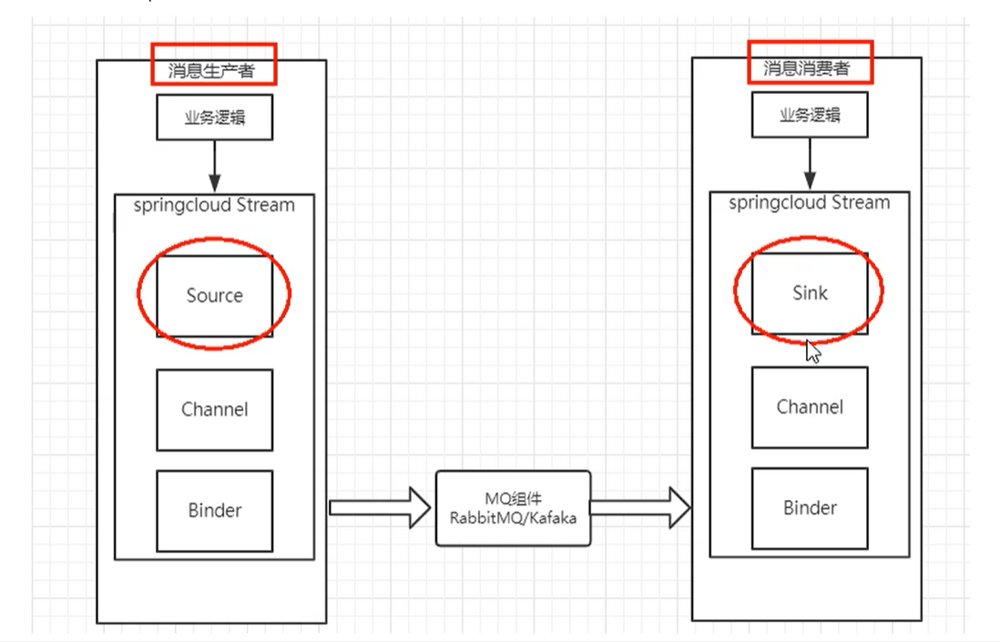
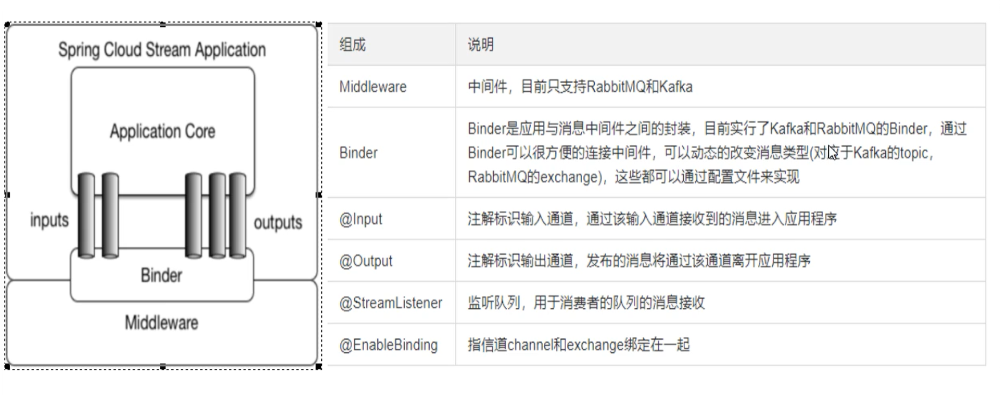
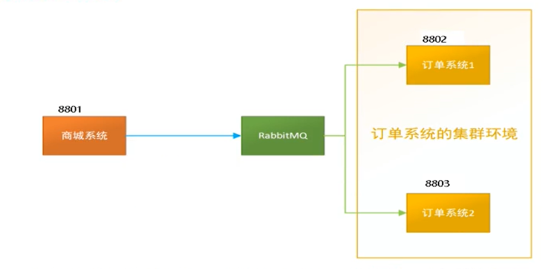
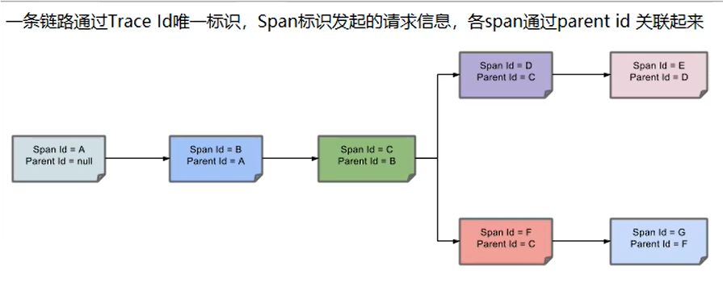
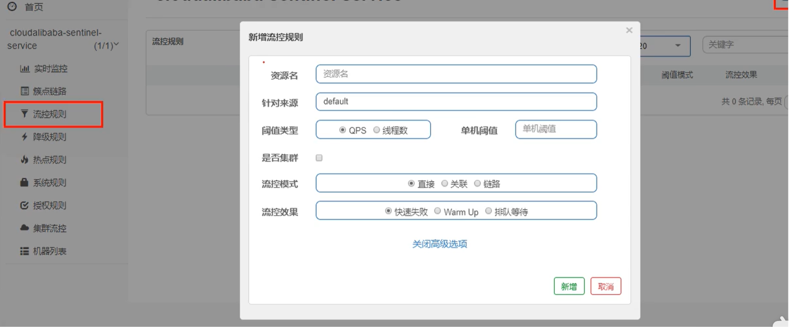
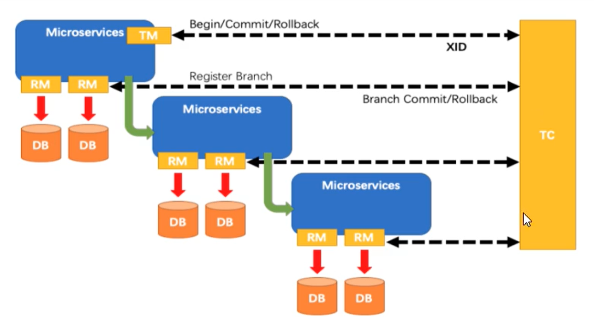
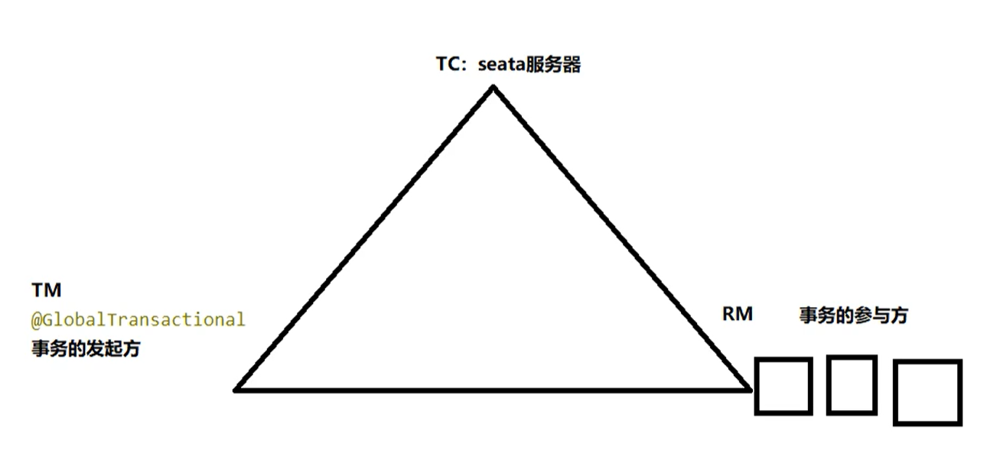
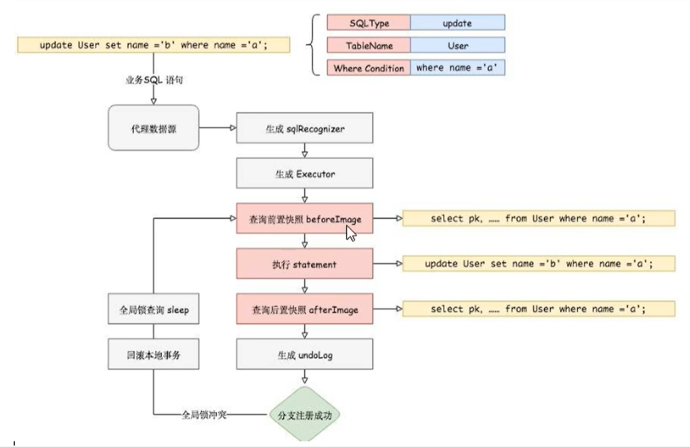
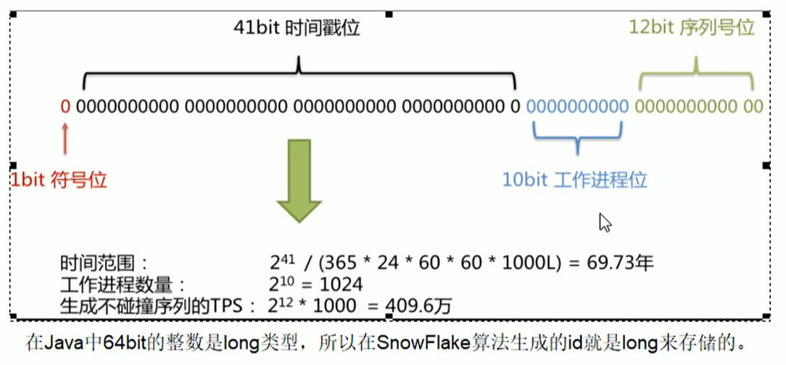

# Spring Cloud

参考：[尚硅谷SpringCloud2020](https://www.bilibili.com/video/BV18E411x7eT?p=1)


## 微服务

>但通常而言，微服务是一种架构模式或者说是一种架构风格, 它提倡将单一应用程序划分成一组小的服务，每个服务运行，在其独立的自己的进程中，服务之间互相协调、互相配合,为用户提供最终价值。

>服务之间采用轻量级的通信机制互相沟通(通常是基于HTTP的RESTful API)。每个服务都围绕着具体业务进行构建,并粗能够被独立地部署到生产环境、类生产环境等。

> 另外,尽量避免统一的、集中式的服务管理机制，对具体的一个服务而言,应根据业务上下文，选择合适的语言、工具对其进行构建，可以有一个非常轻量级的集中式管理来协调这些服务，可以使用不同的语言来编写服务,也可以使用不同的数据存储。

-----------------------------------------------------------------------------------------

> 微服务化的核心就是将传统的一站式应用，根据业务拆分成一个一个的服务,彻底地去耦合每一个微服务提供单个业务功能的服务,一个服务做一件事,从技术角度看就是一种小而独立的处理过程，类似进程概念，能够自行单独启动或销毁，可以拥有自己独立的数据库。


## SpringCloud


### 本地添加映射

> 修改：C:\Windows\System32\drivers\etc

```
#################SpringCLoud2020######################
127.0.0.1	eureka7001.com
127.0.0.1	eureka7002.com
127.0.0.1	eureka7003.com
```


### 数据库脚本

```sql
/*
 Navicat Premium Data Transfer

 Source Server         : MySQL本机
 Source Server Type    : MySQL
 Source Server Version : 80019
 Source Host           : localhost:3306
 Source Schema         : cloud

 Target Server Type    : MySQL
 Target Server Version : 80019
 File Encoding         : 65001

 Date: 23/11/2020 12:41:33
*/

SET NAMES utf8mb4;
SET FOREIGN_KEY_CHECKS = 0;

-- ----------------------------
-- Table structure for payment
-- ----------------------------
DROP TABLE IF EXISTS `payment`;
CREATE TABLE `payment`  (
  `id` bigint(0) NOT NULL AUTO_INCREMENT COMMENT 'ID',
  `serial` varchar(200) CHARACTER SET utf8 COLLATE utf8_unicode_ci NULL DEFAULT NULL,
  PRIMARY KEY (`id`) USING BTREE
) ENGINE = InnoDB AUTO_INCREMENT = 6 CHARACTER SET = utf8 COLLATE = utf8_unicode_ci ROW_FORMAT = Dynamic;

-- ----------------------------
-- Records of payment
-- ----------------------------
INSERT INTO `payment` VALUES (1, '尚硅谷');
INSERT INTO `payment` VALUES (2, 'alibaba');
INSERT INTO `payment` VALUES (3, '京东');
INSERT INTO `payment` VALUES (4, '头条');
INSERT INTO `payment` VALUES (5, 'Ferris');

SET FOREIGN_KEY_CHECKS = 1;

```


### 父工程pom文件

```xml
<?xml version="1.0" encoding="UTF-8"?>
<project xmlns="http://maven.apache.org/POM/4.0.0" xmlns:xsi="http://www.w3.org/2001/XMLSchema-instance"
    xsi:schemaLocation="http://maven.apache.org/POM/4.0.0https://maven.apache.org/xsd/maven-4.0.0.xsd">

  <modelVersion>4.0.0</modelVersion>

  <groupId>com.atguigu.springcloud</groupId>
  <artifactId>cloud2020</artifactId>
  <version>1.0-SNAPSHOT</version>
  <packaging>pom</packaging>

  <modules>
    <module>cloud-provider-payment8001</module>
  </modules>

  <!--统一管理jar包版本-->
  <properties>
    <project.build.sourceEncoding>UTF-8</project.build.sourceEncoding>
    <maven.compiler.source>1.8</maven.compiler.source>
    <maven.compiler.target>1.8</maven.compiler.target>
    <junit.version>4.12</junit.version>
    <log4j.version>1.2.17</log4j.version>
    <lombok.version>1.18.10</lombok.version>
    <mysql.version>8.0.19</mysql.version>
    <druid.version>1.1.16</druid.version>
    <mybatis.spring.boot.version>2.1.1</mybatis.spring.boot.version>
  </properties>

  <!--子模块继承之后，提供作用：锁定版本+子modlue不用写groupId和version-->
  <dependencyManagement>
    <dependencies>
      <!--springboot2.2.2-->
      <dependency>
        <groupId>org.springframework.boot</groupId>
        <artifactId>spring-boot-dependencies</artifactId>
        <version>2.2.2.RELEASE</version>
        <type>pom</type>
        <scope>import</scope>
      </dependency>
      <!--springcloudHoxton.SR1-->
      <dependency>
        <groupId>org.springframework.cloud</groupId>
        <artifactId>spring-cloud-dependencies</artifactId>
        <version>Hoxton.SR1</version>
        <type>pom</type>
        <scope>import</scope>
      </dependency>
      <dependency>
        <groupId>mysql</groupId>
        <artifactId>mysql-connector-java</artifactId>
        <version>${mysql.version}</version>
      </dependency>
      <dependency>
        <groupId>com.alibaba</groupId>
        <artifactId>druid</artifactId>
        <version>${druid.version}</version>
      </dependency>
      <dependency>
        <groupId>org.mybatis.spring.boot</groupId>
        <artifactId>mybatis-spring-boot-starter</artifactId>
        <version>${mybatis.spring.boot.version}</version>
      </dependency>
      <dependency>
        <groupId>junit</groupId>
        <artifactId>junit</artifactId>
        <version>${junit.version}</version>
      </dependency>
      <dependency>
        <groupId>log4j</groupId>
        <artifactId>log4j</artifactId>
        <version>${log4j.version}</version>
      </dependency>
      <dependency>
        <groupId>org.projectlombok</groupId>
        <artifactId>lombok</artifactId>
        <version>${lombok.version}</version>
        <optional>true</optional>
      </dependency>
    </dependencies>
  </dependencyManagement>

  <build>
    <plugins>
      <plugin>
        <groupId>org.springframework.boot</groupId>
        <artifactId>spring-boot-maven-plugin</artifactId>
        <configuration>
          <fork>true</fork>
          <addResources>true</addResources>
        </configuration>
      </plugin>
    </plugins>
  </build>
</project>
```


#### ---------


### Eureka服务注册与发现

> + Eureka Server 提供服务注册服务  key服务名   value调用地址(集合)
>   
>+ Eureka Client 通过注册中心进行访问
> 
>是一个Java客户端，用于简化Eureka Server的交互，客户端同时也具备一个内置的、使用轮询(round-robin)负载算法的负载均衡器。在应用启动后，将会向Eureka Server发送心跳(默认周期为30秒)。如果Eureka Server在多个心跳周期内没有接收到某个节点的心跳，EurekaServer将会从服务注册表中把这个服务节点移除(默认90秒)


#### Eureka工作原理

> 1. 先启动eureka注册中心
> 2. 启动服务提供者，服务提供者启动后回把自身信息注册金eureka
> 3. 消费者服务在需要调用接口时，使用服务别名去注册中心获取实际的RPC远程调用地址
> 4. 消费者获得调用地址后，底层实际是利用HttpClient技术实现远程调用
> 5. 消费者获取服务地址后会缓存在本地jvm内存中，默认每隔30秒更新一次服务调用地址


#### Eureka集群高可用

> 高可用原理：互相注册，相互守望


#### Eureka保证AP

>Eureka看明白了这一点, 因此在设计时就优先保证可用性。Eureka各个节点都是平等的,几个节点挂掉不会影响正常节点的工作，剩余的节点依然可以提供注册和查询服务。而Eureka的客户端在向某个Eureka注册或时如果发现连接失败,则会自动切换至其它节点，只要有一台Eureka还在,就能保证注册服务可用(保证可用性)，只不过查到的信息可能不是最新的(不保证强一致性)。
>
>除此之外，Eureka还有一种自我保护机制， 如果在15分钟内超过85%的节点都没有正常的心跳，那么Eureka就认为客户端 与注册中心出现了网络故障，此时会出现以下几种情况:
>
>1. Eureka不再从注册列表中移除因为长时间没收到心跳而应该过期的服务
>2. Eureka仍然能够接受新服务的注册和查询请求,但是不会被同步到其它节点上(即保证当前节点依然可用)
>   3.当网络稳定时，当前实例新的注册信息会被同步到其它节点中
>   因此，Eureka可以很好的应对因网络故障导致部分节 点失去联系的情况，而不会像zookeeper那样使整 个注册服务瘫痪。


#### Zookepper保证CP

>当向注册中心查询服务列表时，我们可以容忍注册中心返回的是几分钟以前的注册信息，但不能接受服务直接down掉不可用。也就是说，服务注册功能对可用性的要求要高于一致性。
>
>但是zk会出现这样一种情况， 当master节 点因为网络故障与其他节点失去联系时，剩余节点会重新进行leader选举。问题在于，选举leader的时间太长， 30 ~ 120s,且选举期间整个zk集群都是不可用的,这就导致在选举期间注册服务瘫痪。
>
>在云部署的环境下，因网络问题使得zk集群失去master节点是较大概率会发生的事,虽然服务能够最终恢复，但是漫长的选举时间导致的注册长期不可用是不能容忍的。


#### 自我保护机制

>默认情况下，如果没有自我保护，EurekaServer在一定时间内没有接收到某个微服务实例的心跳，EurekaServer将会注销该实例(默认90秒)。但是当网络分区故障发生时，微服务与EurekaServer之间无法正常通信，以上行为可能变得非常危险了一因为微服务本身其实是健康的，此时本不应该注销这个微服务。
>
>Eureka通过"自我保护模式"来解决这个问题一当EurekaServer节点在短时间内丢失过多客户端时(可能发生了网络分区故障)，那么这个节点就会进入自我保护模式。一旦进入该模式，EurekaServer就会保护服务注册表中的信息，不再删除服务注册表中的数据(也就是不会注销任何微服务)。当网络故障恢复后,该Eureka Server节点会自动退出自我保护模式。
>
>更容易理解的方式
>在自我保护模式中，Eureka Server会保护服务注册表中的信息,不再注销任何服务实例。当它收到的心跳数重新恢复到阈值以上时，该Eureka Server节点就会自动退出自我保护模式。它的设计哲学就是宁可保留错误的服务注册信息，也不盲目注销任何可能健康的服务实例。一句话讲解:好死不如赖活着 AP(可用和容错)


> 服务端关闭自我保护机制

```yml
server:
  port: 7001


eureka:
  instance:
    hostname: eureka7001.com        # eureka服务端的实例名称
  client:
    register-with-eureka: false     # false表示不向注册中心注册自己。
    fetch-registry: false           # false表示自己端就是注册中心，我的职责就是维护服务实例，并不需要去检索服务
    service-url:
      #单机指向自己
      #defaultZone: http://${eureka.instance.hostname}:${server.port}/eureka/
      #集群指向其它eureka
      defaultZone: http://eureka7002.com:7002/eureka/
  server:
    #关闭自我保护机制，保证不可用服务被及时踢除
    enable-self-preservation: false
    #剔除超时两秒的服务
    eviction-interval-timer-in-ms: 2000
```


> 客户端与服务端心跳配置

```yml
server:
  port: 8001


eureka:
  instance:
    #实例名
    instance-id: payment8001
    #访问路径可以显示IP
    prefer-ip-address: true
    #Eureka客户端向服务端发送心跳的时间间隔，单位为秒(默认是30秒)
    lease-renewal-interval-in-seconds: 1
    #Eureka服务端在收到最后一次心跳后等待时间上限，单位为秒(默认是90秒)，超时将剔除服务
    lease-expiration-duration-in-seconds: 2
  client:
    #表示是否将自己注册进EurekaServer默认为true。
    register-with-eureka: true
    #是否从EurekaServer抓取已有的注册信息，默认为true。单节点无所谓，集群必须设置为true才能配合ribbon使用负载均衡
    fetchRegistry: true
    service-url:
      #单机版
      #defaultZone: http://localhost:7001/eureka
      #集群
      defaultZone: http://eureka7001.com:7001/eureka,http://eureka7002.com:7002/eureka
```


### Ribbon负载均衡

> 负载均衡+RestTemplate调用(getForObject方法/getForEntity方法)

> 主要功能是提供客户端的软件负载均衡算法和服务调用。

> 负载均衡策略：比如轮询(RoundRobinRule)、随机(RandomRule)和重试(RetyRule)、根据响应时间加权

> Ribbon本地负载均衡客户端 VS Nginx服务端负载均衡区别
>
> 1. Nginx是服务器负载均衡，客户端所有请求都会交给nginx，然后由nginx实现转发请求。即负载均衡是由服务端实现的。
>
> 2. Ribbon本地负载均衡，在调用微服务接口时候，会在注册中心上获取注册信息服务列表之后缓存到VM本地，从而在本地实现RPC远程服务调用技术。


#### 如何使用

> 主启动类添加注解

```java
@EnableEurekaClient
@SpringBootApplication
@RibbonClient(name = "CLOUD-PAYMENT-SERVICE", configuration = MyRule.class) // 使用自定义负载均衡才需要添加
public class OrderMain80
{
    public static void main(String[] args) {
        SpringApplication.run(OrderMain80.class, args);
    }
}
```


> 负载均衡配置算法

```java
@Configuration
public class ApplicationContextConfig {
    @Bean
    @LoadBalanced // 当为集群时，必须要启用负载均衡策略，不然多个服务不知道调用哪一个
    public RestTemplate getRestTemplate() {
        return new RestTemplate();
    }
}
```


> 服务调用

```java
@Slf4j
@RestController
public class OrderController {

    @Resource
    private RestTemplate restTemplate;
    
    // 集群时，需要指明一种负载均衡策略，不然多个服务，不知道调用哪一个 -> 在RestTemplate配置上添加@LoadBalanced
    public static final String PAYMENT_URL = "http://CLOUD-PAYMENT-SERVICE";

    @GetMapping("/consumer/payment/get/{id}")
    public CommonResult<Payment> getPayment(@PathVariable("id") Long id) {
        return restTemplate.getForObject(PAYMENT_URL+"/payment/get/"+id,CommonResult.class);
    }
   
}
```


#### 组件IRule

> IRule：根据特定算法中从服务列表中选择一个要访问的服务

> + RoundRobinRule 轮询
> + RandomRule 随机 
> + RetryRule  先按照RoundRobinRule的策略获取服务，如果获取失败则再指定时间内重试，获取可用服务
> + WeightResponseTimeRule   对RoundRobinRule的扩展，响应速度越快的实例选择权重越大
> + BestAvailableRule   会先过滤掉由于多次访问故障而处于断路器跳闸状态的服务，然后选择一个并发量最小的服务
> + AvailabilityFilterRule 先过滤掉故障实例，再选择并发较小的实例
> + ZoneAvoidanceRule 默认规则，复合判断server所在区域的性能和server的可用性选择服务器


#### 如何替换

>1. 新建包但不能放在@ComponentScan的扫描范围内
>
>   ```java
>   cn.cps
>       myrule
>       	MySelfRule
>       springcloud
>       	OrderMain80
>   ```
>
>   
>
>2. 新建自己的负载均衡算法配置类 myRule
>
>   ```java
>   @Configuration
>   public class MySelfRule
>   {
>       @Bean
>       public IRule myRandomRule()
>       {
>           return new RandomRule();//定义为随机
>       }
>   }
>   ```
>
>3. 主启动类添加注解@RibbonClient
>
>   ```java
>   @EnableEurekaClient
>   @SpringBootApplication
>   // 注意必须要和服务中的名字大小写一样
>   @RibbonClient(name = "CLOUD-PAYMENT-SERVICE", configuration=MySelfRule.class)
>   public class OrderMain80
>   {
>       public static void main(String[] args) {
>               SpringApplication.run(OrderMain80.class, args);
>       }
>   }
>   ```


#### 负载均衡算法

> 原理：获取某个服务的实例，然后定义算法进行获取去执行请求。使用CAS自旋锁实现原子性。
>
> List<Servicelnstance> instances = discoveryClient.getIlnstances("CLOUD-PAYMENT-SERVICE");
>
> + 轮询：次数(索引) % 实例数 = 实际调用服务实例位置下标，每次服务重启动后rest接口计数从0开始。
>


### OpenFeign负载均衡

> 微服务调用接口 + @FeignClient


>Feign旨在使编写Java Http客户端变得更容易。
>
>前面在使用Ribbon + RestTemplate时，利用RestTemplate对http请求的封装处理，形成了一套模版化的调用方法。但是在实际开发中，由于对服务依赖的调用可能不止一处，往往一个接口会被多处调用，所以通常都会针对每个微服务自行封装一 些客户端类来包装这些依赖服务的调用。
>
>所以Feign在此基础上做了进一 步封装，由他来帮助我们定义和实现依赖服务接口的定义。在Feign的实现下，我们只需创建一个接并使用注解的方式来配置它(以前是Dao接口，上面标注Mapper注解现在是一 个微服务接口上面标注一个Feign注解即可)， 即可完成对服务提供方的接口绑定,简化了使用Spring cloud Ribbon时，自动封装服务调用客户端的开发量。


#### Feign与 OpenFeign

> + Feign：Feign是Spring Cloud组件中的一个轻量级RESTful的HTTP服务客户端Feign内置了Ribbon，用来做客户端负载均衡，去调用服务注册中心的服务。Feign的使用方式是:使用Feign的注解定义接口，调用这个接口，就可以调用服务注册中心的服务。
> + OpenFeign：OpenFeign是Spring Cloud 在Feign的基础上支持了SpringMVC的注解，如@RequesMapping等等。OpenFeign的@FeignClient可以解析SpringMVC的@RequestMapping注解下的接口，并通过动态代理的方式产生实现类，实现类中做负载均衡并调用其他服务。


#### 如何使用

> 主启动类添加注解

```java
@EnableFeignClients
@SpringBootApplication
public class OrderFeignMain80 {
    public static void main(String[] args) {
        SpringApplication.run(OrderFeignMain80.class, args);
    }
}
```


> Service添加注解

```java
@Service
@FeignClient(value = "CLOUD-PAYMENT-SERVICE") // 调用服务
public interface PaymentFeignService {

    @GetMapping(value = "/payment/get/{id}") // 服务的具体路径
    public CommonResult<Payment> getPaymentById(@PathVariable("id") Long id);

    @GetMapping(value = "/payment/feign/timeout")
    public String paymentFeignTimeout();

}
```


#### OpenFeign超时控制

```yml
#设置feign客户端超时时间(OpenFeign默认支持ribbon)
ribbon:
  #指的是建立连接所用的时间，适用于网络状况正常的情况下,两端连接所用的时间
  ReadTimeout: 5000
  #指的是建立连接后从服务器读取到可用资源所用的时间
  ConnectTimeout: 5000
```


#### OpenFeign日志打印功能

> 日志级别

```java
/*
    NONE:默认的,不显示任何日志;
    BASIC:仅记录请求方法、URL、响应状态码及执行时间;
    HEADERS:除了BASIC中定义的信息之外，还有请求和响应的头信息;
    FULL除了HEADERS 中定义的信息之外，还有请求和响应的正文及元数据。
*/
@Configuration
public class FeignConfig {
    @Bean
    Logger.Level feignLoggerLevel(){
        return Logger.Level.FULL;
    }
}
```


> yml文件开启日志打印

```yml
logging:
  level:
    cn.cps.springcloud.service.PaymentFeignService: debug
```


#### Feign远程调用丢失请求头问题


> 加上feign远程调用的请求拦截


```java
/**
 * @Author: Cai Peishen
 * @Date: 2021/3/23 11:02
 * @Description: 解决openfeign丢失请求头
 */
@Configuration
public class GuliFeignConfig {
	@Bean("requestInterceptor")
	public RequestInterceptor requestInterceptor(){
		// Feign在远程调用之前都会先经过这个方法
		return new RequestInterceptor() {
			@Override
			public void apply(RequestTemplate template) {
				// RequestContextHolder拿到刚进来这个请求
				ServletRequestAttributes attributes = (ServletRequestAttributes) RequestContextHolder.getRequestAttributes();
				if(attributes != null){
					HttpServletRequest request = attributes.getRequest(); // 老请求
					if(request != null){
						// 同步请求头数据
						String cookie = request.getHeader("Cookie");
						// 给新请求同步Cookie
						template.header("Cookie", cookie);
					}
				}
			}
		};
	}
}
```


### Hystrix断路器

> Hystrix是一个用于处理分布式系统的延迟和容错的开源库,在分布式系统里,许多依赖不可避免的会调用失败,比如超时、异常等，Hystrix能够保证在一个依赖出问题的情况下，不会导致整体服务失败,避免级联故障,以提高分布式系统的弹性。
>
> 向调用方返回一个符合预期的、可处理的备选响应，而不是长时间的等待或者抛出调用方无法处理的异常


#### 服务降级

>服务降级是从整个系统的负荷情况出发和考虑的，对某些负荷会比较高的情况，为了预防某些功能（业务场景）出现负荷过载或者响应慢的情况，在其内部暂时舍弃对一些非核心的接口和数据的请求，而直接返回一个提前准备好的fallback（退路）错误处理信息。这样，虽然提供的是一个有损的服务，但却保证了整个系统的稳定性和可用性。


##### 如何使用

> 主启动类添加注解@EnableHystrix / @EnableCircuitBreaker

```java
@EnableHystrix
@EnableEurekaClient
@SpringBootApplication
public class PaymentHystrixMain8001
{
    public static void main(String[] args) {
            SpringApplication.run(PaymentHystrixMain8001.class, args);
    }
}
```


>标明处理的方法

```java
@GetMapping("/consumer/payment/hystrix/timeout/{id}")
@HystrixCommand(fallbackMethod = "paymentTimeOutFallbackMethod", commandProperties = {
    @HystrixProperty(name="execution.isolation.thread.timeoutInMilliseconds",value="1000")
})
public String paymentInfo_TimeOut(@PathVariable("id") Integer id)
{
    String result = paymentHystrixService.paymentInfo_TimeOut(id);
    return result;
}
public String paymentTimeOutFallbackMethod(@PathVariable("id") Integer id) {
    return "我是消费者80,对方支付系统繁忙请10秒钟后再试或者自己运行出错请检查自己,o(╥﹏╥)o";
}
```


##### 全局处理

> 给controller类添加注解

```java
@RestController
@DefaultProperties(defaultFallback = "payment_Global_FallbackMethod")
public class OrderHystirxController {

	@HystrixCommand
    public String paymentInfo_TimeOut(@PathVariable("id") Integer id) {
        int age = 10/0;
        String result = paymentHystrixService.paymentInfo_TimeOut(id);
        return result;
    }
    
    // 下面是全局fallback方法
    public String payment_Global_FallbackMethod() {
        return "Global异常处理信息，请稍后再试，/(ㄒoㄒ)/~~";
    }
    
}
```


##### 优雅解决方案

> yml配置

```yml
#启用feign对hystrix支持
feign:
  hystrix:
    enabled: true
```


> 在接口处处理，@FeignClient中添加属性 fallback -> 降级处理

```java
@Component
@FeignClient(value = "CLOUD-PROVIDER-HYSTRIX-PAYMENT", fallback = PaymentFallbackService.class)
public interface PaymentHystrixService {
    @GetMapping("/payment/hystrix/ok/{id}")
    public String paymentInfo_OK(@PathVariable("id") Integer id);

    @GetMapping("/payment/hystrix/timeout/{id}")
    public String paymentInfo_TimeOut(@PathVariable("id") Integer id);
}
```


> 创建实体类继承Feign接口

```java
@Component
public class PaymentFallbackService implements PaymentHystrixService {
    @Override
    public String paymentInfo_OK(Integer id) {
        return "-----PaymentFallbackService fall back-paymentInfo_OK ,o(╥﹏╥)o";
    }

    @Override
    public String paymentInfo_TimeOut(Integer id) {
        return "-----PaymentFallbackService fall back-paymentInfo_TimeOut ,o(╥﹏╥)o";
    }
}
```


#### 服务熔断


> 服务雪崩

>多个微服务之间调用的时候，假设微服务A调用微服务B和微服务C，微服务B和微服务C又调用其它的微服务,这就是所谓的“扇出”。如果扇出的链路上某个微服务的调用响应时间过长或者不可用，对微服务A的调用就会占用越来越多的系统资源,进而引起系统崩溃,所谓的“雪崩效应”.

>熔断机制是应对雪崩效应的一种微服务链路保护机制。
>当扇出链路的某个微服务不可用或者响应时间太长时，会进行服务的降级,进而熔断该节点微服务的调用,快速返回”错误”的响应信息。当检测到该节点微服务调用响应正常后恢复调用链路。

> 类比保险丝到最大服务访问后，直接拒绝访问，拉闸限电，然后调用服务降级的方法返回友好提示
> **服务降级 -> 进而熔断 -> 恢复调用**


##### 熔断类型

> + 熔断打开：请求不再进行调用当前服务，内部设置时钟一般为MTTR(平均故障处理时间)，当打开时长达到所设时钟则进入半熔断状态
>
> + 熔断关闭：熔断关闭不会对服务进行熔断，再有请求调用的时候，将不会调用主逻辑，而是直接调用降级fallback
> + 熔断半开：部分请求根据规则调用当前服务，如果请求成功且符合规则认为当前服务恢复正常，关闭熔断


##### 如何使用

> + 快照时间窗：断路器确定是否打开需要统计一些请求和错误数据，而统计的时间范围就是快照时间窗，默认为最近的10秒。
> + 请求总数阀值：在快照时间窗内，必须满足请求总数阀值才有资格熔断。默认为20，意味着在10秒内，如果该nysti命令的调用次数不足20次，使所有的请求都超时或其他原因失败，断路器都不会打开。
> + 错误百分比阀值：当请求总数在快照时间窗内超过了阀值，比如发生了30次调用，如果在这30次调用中，有15次发生了超时异常，也就是超过50%的错误百分比，在默认设定50%阀值情况下，这时候就会将断路器打开。


>主启动类添加注解@EnableHystrix / @EnableCircuitBreaker

```java
@EnableHystrix
@EnableEurekaClient
@SpringBootApplication
public class PaymentHystrixMain8001
{
    public static void main(String[] args) {
            SpringApplication.run(PaymentHystrixMain8001.class, args);
    }
}
```


> 标明处理的方法

```java
@HystrixCommand(fallbackMethod = "paymentCircuitBreaker_fallback",commandProperties = {
    @HystrixProperty(name = "circuitBreaker.enabled",value = "true"),// 是否开启断路器
    @HystrixProperty(name = "circuitBreaker.requestVolumeThreshold",value = "10"),// 请求次数
    @HystrixProperty(name = "circuitBreaker.sleepWindowInMilliseconds",value = "10000"), // 时间窗口期
    @HystrixProperty(name = "circuitBreaker.errorThresholdPercentage",value = "60")// 失败率达到多少后跳闸
})
public String paymentCircuitBreaker(@PathVariable("id") Integer id) {
    if(id < 0) {
        throw new RuntimeException("******id 不能负数");
    }
    String serialNumber = IdUtil.simpleUUID();
    return Thread.currentThread().getName()+"\t"+"调用成功，流水号: " + serialNumber;
}
public String paymentCircuitBreaker_fallback(@PathVariable("id") Integer id) {
    return "id 不能负数，请稍后再试，/(ㄒoㄒ)/~~   id: " +id;
}
```


#### 熔断VS降级

参考：[何时进行服务熔断、服务降级、服务限流?](https://blog.csdn.net/llianlianpay/article/details/79768890)

##### 异同点

> + 服务熔断的作用类似于我们家用的保险丝，当某服务出现不可用或响应超时的情况时，为了防止整个系统出现雪崩，进而熔断该节点微服务的调用，快速返回错误的响应信息。当检测到该节点微服务调用响应正常后，恢复调用链路。
>
> + 服务降级是从整个系统的负荷情况出发和考虑的，对某些负荷会比较高的情况，为了预防某些功能（业务场景）出现负荷过载或者响应慢的情况，在其内部暂时舍弃对一些非核心的接口和数据的请求，而直接返回一个提前准备好的fallback（退路）错误处理信息。这样，虽然提供的是一个有损的服务，但却保证了整个系统的稳定性和可用性。
>
> + 相同点：
>
>     目标一致 都是从可用性和可靠性出发，为了防止系统崩溃；用户体验类似 最终都让用户体验到的是某些功能暂时不可用；
>
>   + 不同点：
>
>   触发原因不同 服务熔断一般是某个服务（下游服务）故障引起，而服务降级一般是从整体负荷考虑；
>


#### 监控仪表盘

> HystrixDashboard

> 除了隔离依赖服务的调用以外，Hystrix还提供了准实时的调用监控（Hystrix Dashboard），Hystrix会持续地记录所有通过Hystrix发起的请求的执行信息，并以统计报表和图形的形式展示给用户，包括每秒执行多少请求多少成功，多少失败等。Netflix通过hystrix-metrics-event-stream项目实现了对以上指标的监控。


##### 如何使用

> 配置主启动类

```java
@SpringBootApplication
@EnableHystrixDashboard
public class HystrixDashboardMain9001 {
    public static void main(String[] args) {
        SpringApplication.run(HystrixDashboardMain9001.class, args);
    }
}
```


> 打开监控地址：http://localhost:9001/hystrix

> 测试服务的格式：http://localhost:8001/actuator/hystrix.stream


>Unable to connect to Command Metric Stream解决办法

```java
/**
* 使用Dashboard的坑，在其他服务中配置（8001）
* 此配置是为了服务监控而配置，与服务容错本身无关，springcloud升级后的坑
* ServletRegistrationBean因为springboot的默认路径不是"/hystrix.stream"
* 只要在自己的项目里配置上下面的servlet就可以了
*/
@Bean
public ServletRegistrationBean getServlet() {
    HystrixMetricsStreamServlet streamServlet = new HystrixMetricsStreamServlet();
    ServletRegistrationBean registrationBean = new ServletRegistrationBean(streamServlet);
    registrationBean.setLoadOnStartup(1);
    registrationBean.addUrlMappings("/actuator/hystrix.stream");
    registrationBean.setName("HystrixMetricsStreamServlet");
    return registrationBean;
}

// 这个也需要配上
@Bean
@LoadBalanced
RestTemplate restTemplate() {
    return new RestTemplate();
}
```


##### 如何看监测数据：7色 1圈 1线

参考： [Hystrix仪表盘监控HystrixDashboard](https://www.cnblogs.com/coding-farmer/p/12032403.html)

```
7色：
	绿 成功色
	蓝 熔断数
	青 错误请求数
	黄 超时数
	紫 线程拒绝数
	红 失败/异常数
	灰 最近10s错误百分比

实心圆：共有两种含义。它通过颜色的变化代表了实例的健康程度，它的健康度从绿色<黄色<橙色<红色递减。
该实心圆除了颜色的变化之外，它的大小也会根据实例的请求流量发生变化，流量越大该实心圆就越大。所以通过该实心圆的展示，就可以在大量的实例中快速的发现 故障实例和高压力实例。

曲线：用来记录2分钟内流量的相对变化，可以通过它来观察到流量的上升和下降趋势。
```


### Zuul路由网关

> Zuul包含了对请求的路由和过滤两个最主要的功能：

>其中路由功能负责将外部请求转发到具体的微服务实例上，是实现外部访问统一入口的基础而过滤器功能则负责对请求的处理过程进行干预，是实现请求校验、服务聚合等功能的基础.


#### Zuul与Gateway对比

>过滤器与网关的区别：过滤器用于拦截单个服务、网关拦截整个的微服务
>
>Zuul与Gateway有那些区别
>Zuul网关属于netfix公司开源的产品属于第一代微服务网关
>Gateway属于SpringCloud自研发的第二代微服务网关
>相比来说SpringCloud Gateway性能比Zuul性能要好：
>注意：Zuul基于Servlet实现的，阻塞式的Api，不支持长连接。
>SpringCloudGateway基于Spring5构建，能够实现响应式非阻塞式的Api，支持长连接，能够更好的整合Spring体系的产品。
>
>基于Spring Framework 5, Project Reactor和Spring Boot 2.0进行构建;动态路由:能够匹配任何请求属性;
>可以对路由指定Predicate(断言)和Filter (过滤器);集成Hystrix的断路器功能;
>集成Spring Cloud 服务发现功能;
>易于编写的Predicate(断言）和 Filter (过滤器);请求限流功能;
>支持路径重写。

 

 

### Gateway

> Spring Cloud Gateway 使用的Webflux中的reactor-netty响应式编程组件，底层使用了Netty通讯框架

> 微服务网关是整个微服务API请求的入口，可以实现日志拦截、权限控制、解决跨域问题、限流、熔断、负载均衡、黑名单与白名单拦截、授权等

>构成
>
>+ route：路由是构建网关的基本模块，它由ID，目标URI，一系列的断言和过滤器组成，如果断言为true则匹配该路由
>
>+ Filter ：指的是Spring框架中GatewayFilter的实例，使用过滤器，可以在请求被路由前或者之后对请求进行修改。
>
>+ predicate：参考的是java8的java.util.function.Predicate开发人员可以匹配HTTP请求中的所有内容（例如请求头或请求参数），如果请求与断言相匹配则进行路由


#### 工作流程

>路由转发+执行过滤器链


#### Route路由

> 默认情况下Gateway会根据注册中心的服务列表，以注册中心上微服务名为路径创建动态路由进行转发，从而实现动态路由的功能

> 需要注意的是uri的协议为lb，表示启用Gateway的负载均衡功能。
>
> ```
> uri:lb://cloud-payment-service      #匹配后提供服务的路由地址
> ```


#### Predicate断言

> 实现一组匹配规则

>+ After Route Predicate： 
>
>
>  ```java
>  ZonedDateTime zonedDateTime = ZonedDateTime.now();
>  System.out.println(zonedDateTime);
>  ```
>
>  ```yml
> - After=2020-03-08T10:59:34.102+08:00[Asia/Shanghai]
> ```
>  
>+ Before Route Predicate
>
>```yml
> - After=2020-03-08T10:59:34.102+08:00[Asia/Shanghai]
> - Before=2020-03-08T10:59:34.102+08:00[Asia/Shanghai]
> ```
>  
>+ Between Route Predicate
>
>```yml
> - Between=2020-03-08T10:59:34.102+08:00[Asia/Shanghai] , 2020-03-08T10:59:34.102+08:00[Asia/Shanghai]
> ```
>  
>+ Cookie Route Predicate
>
>```yml
>  #https://blog.csdn.net/leedee/article/details/82685636 #cookie乱码
> - Cookie=username,atguigu    #并且Cookie是username=zhangshuai才能访问
> ```
>  
>+ Header Route Predicate
>
>```yml
> - Header=X-Request-Id, \d+   #请求头中要有X-Request-Id属性并且值为整数的正则表达式
> ```
>  
>+ Host Route Predicate
>
>```yml
> - Host=**.atguigu.com
> ```
>  
>+ Method Route Predicate
>
>```yml
> - Method=GET
> ```
>  
>+ Path Route Predicate
>
>```yml
> - Path=/payment/get/**
> ```
>  
>+ Query Route Predicate
>
>```yml
> - Query=username, \d+ #要有参数名称并且是正整数才能路由
> ```


#### Filter过滤器

> + 生命周期
>
>   + pre，在业务逻辑之前
>   + post，在业务逻辑之后
>
> + 种类
>
>   + GatewayFilter，单一
>
>     ```yml
>    filters:
>   - AddRequestHeader=X-Request-Foo, Bar
>     ```
>
>   + GlobalFilter，全局
>
>     自定义过滤器自定义过滤器 impiemerts GlobalFilter，Ordered；可以全局日志记录、统一网关鉴权
>
>     ```java
>     @Slf4j
>     @Component
>     public class MyLogGateWayFilter implements GlobalFilter,Ordered {
>     	@Override
>         public Mono<Void> filter(ServerWebExchange exchange, GatewayFilterChain chain) {
>             log.info("***********come in MyLogGateWayFilter:  "+new Date());
>             String uname = exchange.getRequest().getQueryParams().getFirst("uname");
>             if(uname == null) {
>                 log.info("*******用户名为null，非法用户，o(╥﹏╥)o");
>                 exchange.getResponse().setStatusCode(HttpStatus.NOT_ACCEPTABLE);
>                 return exchange.getResponse().setComplete();
>             }
>             return chain.filter(exchange);
>         }
>     
>         @Override
>         public int getOrder() {
>             return 0;
>         }
>     }
>     ```


> yml配置

```yml
server:
  port: 9527

spring:
  application:
    name: cloud-gateway-service
  cloud:
    gateway:
      discovery:
        locator:
          enabled: true                       #开启从注册中心动态创建路由的功能，利用微服务名进行路由
      routes:
        - id: payment_routh #payment_route    #路由的ID，没有固定规则但要求唯一，建议配合服务名
          #uri: http://localhost:8001         #匹配后提供服务的路由地址
          uri: lb://cloud-payment-service     #匹配后提供服务的路由地址
          predicates:
            - Path=/payment/get/**         # 断言，路径相匹配的进行路由

        - id: payment_routh2 #payment_route    #路由的ID，没有固定规则但要求唯一，建议配合服务名
          #uri: http://localhost:8001          #匹配后提供服务的路由地址
          uri: lb://cloud-payment-service      #匹配后提供服务的路由地址
          predicates:
            - Path=/payment/lb/**         # 断言，路径相匹配的进行路由
            #- After=2020-02-21T15:51:37.485+08:00[Asia/Shanghai]
            #- Cookie=username,zzyy
            #- Header=X-Request-Id, \d+  # 请求头要有X-Request-Id属性并且值为整数的正则表达式

eureka:
  instance:
    hostname: cloud-gateway-service
  client: #服务提供者provider注册进eureka服务列表内
    service-url:
      register-with-eureka: true
      fetch-registry: true
      defaultZone: http://eureka7001.com:7001/eureka
```


### Config分布式配置中心

> 是什么
>
> SpringCloud Config为微服务架构中的微服务提供集中化的外部配置支持，配置服务器为各个不同微服务应用的所有环境提供了一个中心化的外部配置。


> 怎么玩

>SpringCloud Config分为服务端和客户端两部分。
>
>+ 服务端也称为分布式配置中心，它是一个独立的微服务应用，用来连接配置服务器并为客户端提供获取配置信息,加密/解密信息等访问接口
>
>+ 客户端则是通过指定的配置中心来管理应用资源，以及与业务相关的配置内容,并在启动的时候从配置中心获取和加载配置信息
>
>配置服务器默认采用git来存储配置信息,这样就有助于对环境配置进行版本管理,并且可以通过git客户端工具来方便的管理和访问配置内容。


#### 服务端

##### 如何使用

> 配置主启动类

```yml
@EnableConfigServer
@SpringBootApplication
public class ConfigCenterMain3344 {
    public static void main(String[] args) {
            SpringApplication.run(ConfigCenterMain3344.class, args);
    }
}
```


> 配置yml

```yml
server:
  port: 3344

spring:
  application:
    name: cloud-config-center #注册进Eureka服务器的微服务名
  cloud:
    config:
      server:
        git:
        #GitHub上面的git仓库名字，所以要先创建一个配置中心的项目
          uri: https://github.com/Cps-Ferris/springcloud2020-config.git 
        ####搜索目录
          search-paths:
            - springcloud2020-config
      ####读取分支
      label: master

#服务注册到eureka地址
eureka:
  client:
    service-url:
      defaultZone: http://localhost:7001/eureka
```


##### 配置读取规则

> + /{label}/{application}-{profile}.yml（最推荐使用这种方式）
>
>   ```yml
>   http://config-3344.com:3344/master/config-dev.yml
>   http://config-3344.com:3344/master/config-test.yml
>   http://config-3344.com:3344/master/config-prod.yml
>   ####################
>   http://config-3344.com:3344/dev/config-dev.yml
>   http://config-3344.com:3344/dev/config-test.yml
>   http://config-3344.com:3344/dev/config-prod.yml
>   ```
>
> + /{application}-{profile}.yml
>
>   ```yml
>   http://config-3344.com:3344/config-dev.yml
>   http://config-3344.com:3344/config-test.yml
>   http://config-3344.com:3344/config-prod.yml
>   ```
>
> + /{application}/{profile}/{label}
>
>   ```yml
>   http://config-3344.com:3344/config/dev/master
>   http://config-3344.com:3344/config/test/master
>   http://config-3344.com:3344/config/prod/master
>   ```


#### 客户端

> bootstrap.yml：
>
> + applicaiton.yml 是用户级的资源配置项
>
> + bootstrap.yml 是系统级的,优先级更加高


##### 如何使用

> 主启动类

```java
@EnableEurekaClient
@SpringBootApplication
public class ConfigClientMain3355
{
    public static void main(String[] args) {
            SpringApplication.run(ConfigClientMain3355.class, args);
    }
}
```


> yml配置

```yml
server:
  port: 3355

spring:
  application:
    name: config-client
  cloud:
    #Config客户端配置
    config:
      label: master #分支名称
      name: config #配置文件名称
      profile: dev #读取后缀名称   上述3个综合：master分支上config-dev.yml的配置文件被读取http://config-3344.com:3344/master/config-dev.yml
      uri: http://localhost:3344 #配置中心地址

#服务注册到eureka地址
eureka:
  client:
    service-url:
      defaultZone: http://localhost:7001/eureka
```


##### 动态刷新手动版

> 引入actuator监控

```xml
<dependency>
    <groupId>org.springframework.boot</groupId>
    <artifactId>spring-boot-starter-actuator</artifactId>
</dependency>
```


> 暴露监控端口

```yml
server:
  port: 3355

spring:
  application:
    name: config-client
  cloud:
    config:
      label: master
      name: config
      profile: dev
      uri: http://localhost:3344
      
eureka:
  client:
    service-url:
      defaultZone: http://eureka7001.com:7001/eureka

#暴露监控端口	
management:
  endpoints:
    web:
      exposure:
        include: "*"
```


> @RefreshScope业务类Controller修改

```java
@RefreshScope //动态刷新
@RestController
public class ConfigClientController {

    @Value("${config.info}")
    private String configInfo;

    @GetMapping("/configInfo")
    public String getConfigInfo() {
        return configInfo;
    }
    
}
```


> 需要手动刷新访问路径

```cmd
curl -X POST "http://localhost:3355/actuator/refresh"
```


> 自动刷新使用Bus，下方持续跟进


### Bus消息总线动态刷新

> 是什么
>
> 在微服务架构的系统中，通常会使用轻量级的消息代理来构建一个共用的消息主题，并让系统中所有微服务实例都连接上来。由于该主题中产生的消息会被所有实例监听和消费，所以称它为消息总线。在总线上的各个实例，都可以方便地广播一些需要让其他连接在该主题上的实例都知道的消息。解决上方手动刷新config
>
> 目前支持：RabbitMQ和Kafka


> 基本原理
>
> ConfigClient实例都监听MQ中同一个topic(默认是springCloudBus)。当一个服务刷新数据的时候，它会把这个信息放入到Topic中，这样其它监听同一Topic的服务就能得到通知，然后去更新自身的配置。


#### 涉及思想

>+ 1) 利用消息总线触发一个客户端/bus/refresh，而刷新所有客户端的配置
>+ 2) 利用消息总线触发一个服务端ConfigServer的/bus/refresh端点，而刷新所有客户端的配置（推荐）


#### 如何使用

> 给cloud-config-center-3344配置中心服务端添加消息总线支持

```xml
<dependency>
    <groupId>org.springframework.cloud</groupId>
    <artifactId>spring-cloud-starter-bus-amqp</artifactId>
</dependency>
```

```yml
#注意这里是在spring下的
spring:
  rabbitmq:
    host: localhost
    port: 5672
    username: guest
    password: guest
    
management:
  endpoints:
    web:
      exposure:
        include: 'bus-refresh'
```


> 给cloud-config-center-3355客户端添加消息总线支持

```xml
<dependency>
    <groupId>org.springframework.cloud</groupId>
    <artifactId>spring-cloud-starter-bus-amqp</artifactId>
</dependency>
```

```yml
#注意这里是在spring下的
spring:
  rabbitmq:
    host: localhost
    port: 5672
    username: guest
    password: guest

management:
  endpoints:
    web:
      exposure:
        include: "*"
```


> 给cloud-config-center-3366客户端添加消息总线支持

```xml
<dependency>
    <groupId>org.springframework.cloud</groupId>
    <artifactId>spring-cloud-starter-bus-amqp</artifactId>
</dependency>
```

```yml
#注意这里是在spring下的
spring:
  rabbitmq:
    host: localhost
    port: 5672
    username: guest
    password: guest

management:
  endpoints:
    web:
      exposure:
        include: "*"
```


> 一次发送处处生效

```cmd
curl -X POST "http://localhost:3344/actuator/bus-refresh"
```


> 刷新定点通知

```cmd
#http://localhost:配置中心的端口号/actuator/bus-refresh/{destination}
curl -X POST "http://localhost:3344/actuator/bus-refresh/config-client:3355"
```


### Stream消息驱动

> Binder
>
> + INPUT对应于消费者
> + OUTPUT对应于生产者
>
> 屏蔽底层消息中间件的差异，降低切换版本，统一消息的编程模型；目前只支持RabbitMQ和Kafka


#### 基本原理

>在没有绑定器这个概念的情况下，我们的SpringBoot应用要直接与消息中间件进行信息交互的时候，由于各消息中间件构建的初衷不同，它们的实现细节上会有较大的差异性
>**通过定义绑定器作为中间层，完美地实现了成用程序与消息中间件细节之间的隔离。**
>通过向应用程序暴露统一的Channel通道，使得应用程序不需要再考虑各种不同的消息中间件实现。


#### Stream标准流程




#### 常用API和注解




#### 重复消费问题



>默认分组group是不同的
>
>Stream中处于同一个group的多个消费者是竞争关系，就能够保证消息只会被其中一个应用消费一次
>
>**微服务应用放置于同一个group中，就能够保证消息只会被其中一个应用消费一次**
>
>**不同的组是可以消费的，同一个组内会发生竞争关系，只有其中一个可以消费**


> 如何配置

```yml
spring:
  application:
    name: cloud-stream-consumer
  cloud:
      stream:
        binders: # 在此处配置要绑定的rabbitmq的服务信息；
          defaultRabbit: # 表示定义的名称，用于于binding整合
            type: rabbit # 消息组件类型
            environment: # 设置rabbitmq的相关的环境配置
              spring:
                rabbitmq:
                  host: localhost
                  port: 5672
                  username: guest
                  password: guest
        bindings: # 服务的整合处理
          input: # 这个名字是一个通道的名称
            destination: studyExchange # 表示要使用的Exchange名称定义
            content-type: application/json # 设置消息类型，本次为对象json，如果是文本则设置“text/plain”
            binder: defaultRabbit # 设置要绑定的消息服务的具体设置
            group: springcloud-stream # 消费组
```


#### 消息持久化

> 配置group就配置了持久化


### Sleuth链路追踪

> Spring Cloud Sleuth提供了一套完整的服务跟踪的解决方案


#### zipkin

> sleuth用来收集，zipkin用来展示
>
> Spring Cloud Sleuth 可以结合 Zipkin，将信息发送到 Zipkin，利用 Zipkin 的存储来存储信息，利用 Zipkin UI 来展示数据 


#### 下载

> SpringCloud从F版起已不需要自己构建Zipkin Server了，只需调用jar包即可
>
> https://dl.bintray.com/openzipkin/maven/io/zipkin/java/zipkin-server/
>
> zipkin-server-2.12.9-exec.jar
>
> java -jar zipkin-server-2.12.9-exec.jar
>
> http://localhost:9411/zipkin/


#### 链路图

> + span:表示调用链路来源，通俗的理解span就是一次请求信息
> + Trace:类似于树结构的Span集合，表示一条调用链路，存在唯一标识




#### 如何使用

> 运行zipkin-serverjar包

```cmd
java -jar zipkin-server-2.12.9-exec.jar
```


> yml配置

```yml
spring:
  application:
    name: cloud-order-service
  zipkin:
    base-url: http://localhost:9411
  sleuth:
    sampler:
      #采样率值介于 0 到 1 之间，1 则表示全部采集
      probability: 1
```


> 请求controller


>http://localhost:9411/zipkin/查看


## Spring Cloud Alibaba

>+ **服务限流降**：默认支持WebServlet、WebFlux, OpenFeign、RestTemplate、Spring Cloud Gateway, Zuul, Dubbo和RocketMQ限流降级功能的接入，可以在运行时通过控制台实时修改限流降级规则，还支持查看限流降级Metrics监控。
>+ **服务注册与发现**：适配 Spring Cloud服务注册与发现标准，默认集成了Ribbon的支持。分布式配置管理:支持分布式系统中的外部化配置，配置更改时自动刷新。
>+ **消息驱动能力**：基于Spring Cloud Stream为微服务应用构建消息驱动能力。
>+ **分布式事务**：使用@GlobalTransactional注解，高效并且对业务零侵入地解决分布式事务问题。
>+ **阿里云对象存储**：阿里云提供的海星、安全、低成本、高可靠的云存储服务。支持在任何应用、任何时间、任何地点存储和访问任意类型的数据。
>+ **分布式任务调度**：提供秒级、精准、高可靠、高可用的定时(基于Cron表达式）任务调度服务。同时提供分布式的任务执行模型，如网格任务。网格任务支持海量子任务均匀分配到所有Worker (schedulerx-client)上执行。
>+ **阿里云短信服务**：覆盖全球的短信服务，友好、高效、智能的互联化通讯能力，帮助企业迅速搭建客户触达通道。

```xml
<dependency>
    <groupId>com.alibaba.cloud</groupId>
    <artifactId>spring-cloud-alibaba-dependencies</artifactId>
    <version>2.1.0.RELEASE</version>
    <type>pom</type>
    <scope>import</scope>
</dependency>
```


### Nacos

> [—个更易于构建云原生应用的动态服务发现、配置管理和服务管理平台](https://github.com/alibaba/Nacos)


#### 如何下载

> + https://github.com/alibaba/nacos/releases/tag/1.1.4
>+ 解压安装包，直接运行bin目录下的startup.cmd
> + 命令运行成功后直接访问http://localhost:8848/nacos
> + 默认账号密码都是nacos
> + Linux 单机运行Nacos：./startup.sh -m standalone


#### 服务注册中心对比

| 服务注册与发现 | CAP模型 | 控制台管理 | 社区活跃度    |
| -------------- | ------- | ---------- | ------------- |
| Eureka         | AP      | 支持       | 低（2.x闭源） |
| Zookeeper      | CP      | 不支持     | 中            |
| Consul         | AP      | 支持       | 高            |
| Nacos          | AP + CP | 支持       | 高            |


> CAP
>
> + C是所有节点在同一时间看到的数据是一致的
>
> + 而A的定义是所有的请求都会收到响应。


>+ Zookeeper采用CP保证数据的一致性的问题，原理采用Zab原子广播协议，当我们的zk领导因为某种原因宕机的情况下，会自动出发重新选一个新的领导角色，整个选举的过程为了保证数据的一致性的问题，在选举的过程中整个zk环境是不可以使用，可以短暂可能无法使用到zk，以为者微服务采用该模式的情况下，可能无法实现通讯。(本地有缓存除外)。
>
>  注意：可运行节点必须满足过半机制，整个zk采用使用。
>  三台集群：两台宕机，一台正常，还是没法使用需要过半选举。
>  zad协议通过比较myid谁最大谁为领导角色，只要满足过半机制就可以称为领导者。
>  如何办证数据一致性，所有写的请求都交给我们领导角色实现，领导写完，再将数据同步每个节点(也就是说,选举过程中不能注册服务)
>
>+ Eureka采用ap的设计理念架构注册中心，完全去中心化思想，也就是没有主从之分。每个节点都是均等，采用相互注册原理，你中有我我中你，只要最后有一个eureka节点存在就可以保证整个微服务可以实现通讯，相互注册
>
>+ Nacos.从1.0版本支持CP和AP混合模式集群，默认是采用Ap保证服务可用性，CP的形式底层集群raft协议保证数据的一致性的问题。
>  如果我们采用Ap模式注册服务的实例仅支持临时注册形式，在网络分区产生抖动的情况正任然还可以继续注册我们的服务列表。
>  那么选择CP模式必须保证数据的强一致性的问题，如果网络分区产生抖动的情况下，是无法注册我们的服务列表。选择CP模式可以支持注册实例持久


#### Nacos注册配置中心

> 记录所有的服务信息，以Map<String,List<Object>>存储个服务信息，key为服务名，我们通过服务名就可以取。
>
> 自定义负载均衡，获取所有服务，它采用策略模式，就是声明接口，我们只需要去继承该接口，实现返回服务的方法就可以。


#### Nacos配置中心管理

>本地应用读取我们云端分布式配置中心文件(第一次建立长连接)。
>本地应用读取到配置文件之后，本地jvm和硬盘中都会缓存一份。
>本地应用与分布式配置中心服务器端一直保持长连接.
>当我们的配置文件发生变化(MD5|版本号)实现区分，将变化结果通知给我们的本地应用，及时的刷新我们的配置文件


##### 如何使用（服务注册和配置中心）

> 修改pom

```xml
<!--nacos-config-->
<dependency>
    <groupId>com.alibaba.cloud</groupId>
    <artifactId>spring-cloud-starter-alibaba-nacos-config</artifactId>
</dependency>
<!--nacos-discovery-->
<dependency>
    <groupId>com.alibaba.cloud</groupId>
    <artifactId>spring-cloud-starter-alibaba-nacos-discovery</artifactId>
</dependency>
```


> 修改yml - bootstrap

```yml
# nacos配置
server:
  port: 3377

spring:
  application:
    name: nacos-config-client
  cloud:
    nacos:
      discovery:
        server-addr: localhost:8848 #Nacos服务注册中心地址
      config:
        server-addr: localhost:8848 #Nacos作为配置中心地址
        file-extension: yaml #指定yaml格式的配置
        group: DEV_GROUP
        namespace: 7d8f0f5a-6a53-4785-9686-dd460158e5d4

# ${spring.application.name}-${spring.profile.active}.${spring.cloud.nacos.config.file-extension}
# nacos-config-client-dev.yaml

# nacos-config-client-test.yaml  ---->  config.info
```


> 修改yml - application

```yml
spring:
  profiles:
    active: dev # 表示开发环境
```


> 修改主启动类

```java
@EnableDiscoveryClient
@SpringBootApplication
public class NacosConfigClientMain3377 {
    public static void main(String[] args) {
        SpringApplication.run(NacosConfigClientMain3377.class, args);
    }
}
```


> 添加自动刷新注解

```java
@RefreshScope
@RestController
public class ConfigClientController {
    @Value("${config.info}")
    private String configInfo;

    @GetMapping("/config/info")
    public String getConfigInfo() {
        return configInfo;
    }
}
```


##### Namespace+Group+Data ID


>默认情况:
>Namespace=public，Group=DEFAULT_GROUP，默认Cluster是DEFAULT
>
>Nacos默认的命名空间是public，Namespace主要用来实现隔离。
>比方说我们现在有三个环境：开发、测试、生产环境，我们就可以创建三个Namespace不同的Namespace之间是隔离的。
>
>Group默认是DEFAULT_GROUP,Group可以把不同的微服务划分到同一个分组里面去
>
>Service就是微服务；一个Service可以包含多个Cluster (集群)，Nacos默认Cluster是DEFAULT，Cluster是对指定微服务的一个虚拟划分。比方说为了容灾，将Service微服务分别部署在了杭州机房和广州机房，
>这时就可以给杭州机房的Service微服务起一个集群名称(HZ) ,
>给广州机房的Service微服务起一个集群名称(GZ)，还可以尽量让同一个机房的微服务互相调用，以提升性能
>
>最后是lnstance，就是微服务的实例。


##### Nacos集群和持久化（重点）


> 默认Nacos使用嵌入式数据库derby实现数据的存储。所以，如果启动多个默认配置下的Nacos节点，数据存储是存在一致性问题的。**为了解决这个问题，Nacos采用了集中式存储的方式来支持集群化部署，目前只支持MySQL的存储。**


> 集群配置

> 1. mysql数据库配置
>
>    ```
>    nacos-server-1.1.4\nacos\conf目录下找到sql脚本执行
>    ```
>
> 2. application.properties配置
>
>    ```properties
>    #nacos-server-1.1.4\nacos\conf目录下找到application.properties
>    spring.datasource.platform=mysql
>    db.num=1
>    db.url.O=jdbc:mysql://127.0.0.1:3306/nacos_config?characterEncoding=utf8&connectTimeout=1000&socketTimeout=3000&autoReconnect=true
>    db.user=root
>    db.password=123456
>    ```
>
> 3. Linux服务器上nacos的集群配置cluster.conf
>
>    ```
>    #这里一定要写真实ip，127.0.0.1可能会有问题
>    192.168.2.22:3333
>    192.168.2.22:4444
>    192.168.2.22:5555
>    ```
>
> 4. 编辑Nacos的启动脚本startup.sh，使它能够接受不同的启动端
>
>    ```sh
>    #编辑 /mynacos/nacos/bin目录下有startup.sh
>    while getopts ":m:f:s:pr" opt
>    do
>        case $opt in
>            m)
>                MODE=$OPTARG;;
>            f)
>                FUNCTION_MODE=$OPTARG;;
>            s)
>                SERVER=$OPTARG;;
>            p)
>                PORT=$OPTARG;;
>            ?)
>            echo "Unknown parameter"
>            exit 1;;
>    	esac
>    done
>    
>    #倒数第二行
>    nohup $JAVA -Dserver.port=${PORT} ${JAVA_OPT} nacos.nacos >> ${BASE_DIR}/logs/start.out 2>&1 &
>    ```
>
> 5. Nginx的配置，由它作为负载均衡器
>
>    ```sh
>    #修改 /usr/local/nginx/conf/nginx.conf
>    upstream cluster {
>    	server 127.0.0.1:3333;
>    	server 127.0.0.1:4444;
>    	server 127.0.0.1:5555;
>    }
>    
>    server {
>    	listen			1111;
>    	server_name		localhost;
>    	location / {
>    		#root		html;
>    		#index		index.html index.htm;
>    		proxy_pass	http://cluster;	
>    	}
>    }
>    ```
>
> 6. 截止到此处，1个Nginx+3个nacos注册中心+1个mysql
>
>    ```sh
>    #启动naocs集群
>    ./startup.sh -p 3333
>    ./startup.sh -p 4444
>    ./startup.sh -p 5555
>    ps -ef|grep naocs|grep -v grep|wc -l
>    
>    #启动nginx
>    ./nginx -c /usr/local/nginx/conf/nginx.conf
>    ps -ef|grep nginx
>    
>    #测试通过nginx访问nacos
>    http://192.168.181.22:1111/nacos/#/login
>    ```


### Sentinel

> [分布式系统的流量防卫兵](https://github.com/alibaba/Sentinel)
>
> 随着微服务的流行，服务和服务之间的稳定性变得越来越重要。Sentinel 以流星为切入点，从流量控制、熔断降级、系统负载保护等多个维度保护服务的稳定性。


#### 如何下载

> + https://github.com/alibaba/Sentinel/releases/tag/1.7.0
> + java -jar sentinel-dashboard-1.7.0.jar 
> + 访问sentinel管理界面http://localhost:8080
> + 登录账号密码均为sentinel


#### Sentinel特征

> - **丰富的应用场景**：Sentinel 承接了阿里巴巴近 10 年的双十一大促流量的核心场景，例如秒杀（即突发流量控制在系统容量可以承受的范围）、消息削峰填谷、集群流量控制、实时熔断下游不可用应用等。
> - **完备的实时监控**：Sentinel 同时提供实时的监控功能。您可以在控制台中看到接入应用的单台机器秒级数据，甚至 500 台以下规模的集群的汇总运行情况。
> - **广泛的开源生态**：Sentinel 提供开箱即用的与其它开源框架/库的整合模块，例如与 Spring Cloud、Dubbo、gRPC 的整合。您只需要引入相应的依赖并进行简单的配置即可快速地接入 Sentinel。
> - **完善的 SPI 扩展点**：Sentinel 提供简单易用、完善的 SPI 扩展接口。您可以通过实现扩展接口来快速地定制逻辑。例如定制规则管理、适配动态数据源等。


#### Sentinel主要特性


#### Hystrix与Sentinel

> + Hystrix
>
>   需要我们自己手动搭建监控平台
>
>   没有一套Web可以给我们进行更加细粒度化的统一配置
>
> + Sentinel
>
>   单独一个组件，可以独立出来
>
>   直接界面化的细粒度统一配置
>
>   约定 > 配置 > 编码
>
>   都可以写在代码里，但是我们本次还是大规模的学习使用配置和注解的方式，尽量少写代码


#### 流控规则




>+ 资源名：唯一名称，默认请求路径
>+ 针对来源：Sentinel可以针对调用者进行限流，填写微服务名，默认default(不区分来源)
>+ **阈值类型/单机阈值**：
>  + QPS(每秒钟的请求数量)：当调用该api的QPS达到阈值的时候，进行限流。方法内只进来一个
>  + 线程数：当调用该api的线程数达到阈值的时候，进行限流。在方法内进来了全部，但只处理一个
>+ 是否集群：不需要集群
>+ **流控模式**：
>  + 直接：api达到限流条件时，直接限流
>  + 关联：当关联的资源达到阈值时，就限流自己（关联的支付模板达到阈值，限流下单模板）
>  + 链路：只记录指定链路上的流量(指定资源从入口资源进来的流量，如果达到阈值，就进行限流)【api级别的针对来源】
>+ **流控效果**：
>  + 快速失败：直接失败，抛异常
>  + Warm Up：根据codeFactor(冷加载因子，默认3）的值，从阈值/codeFactor，经过预热时长
>    才达到设置的QPS阈值
>  + 排队等待：匀速排队，让请求以匀速的速度通过，阈值类型必须设置为QPS，否则无效


#### 熔断降级

> 概述

> 除了流量控制以外，对调用链路中不稳定的资源进行熔断降级也是保障高可用的重要措施之一。
>
> 一个服务常常会调用别的模块，可能是另外的一个远程服务、数据库，或者第三方 API 等。例如，支付的时候，可能需要远程调用银联提供的 API；查询某个商品的价格，可能需要进行数据库查询。然而，这个被依赖服务的稳定性是不能保证的。
>
> 如果依赖的服务出现了不稳定的情况，请求的响应时间变长，那么调用服务的方法的响应时间也会变长，线程会产生堆积，最终可能耗尽业务自身的线程池，服务本身也变得不可用。 
>
> 因此我们需要对不稳定的**弱依赖服务调用**进行熔断降级，暂时切断不稳定调用，避免局部不稳定因素导致整体的雪崩。熔断降级作为保护自身的手段，通常在客户端（调用端）进行配置 
>
> Sentinel的断路器是没有半开状态的


> 熔断策略

> + RT（平均响应时间，秒级）
>
>   平均响应时间超出阈值且在时间窗口内通过的请求>=5，两个条件同时满足后触发降级窗口期过后关闭断路器
>
>   RT最大4900 (更大的需要通过-Dcsp.sentinel.statistic.max.rt=XXXX才能生效)
>
> + 异常比例（秒级）
>
>   QPS >= 5，且异常比例（秒级统计）超过阈值时，触发降级；时间窗口结束后，关闭降级
>
> + 异常数（分钟级）
>
>   异常数（分钟统计)超过阈值时，触发降级;时间窗口结束后，关闭降级


>- 平均响应时间( DEGRADE_GRADE_RT )：当1s内持续进入5个请求，对应时刻的平均响应时间（秒级）均超过阈值（ count，以ms为单位)，那么在接下的时间窗口（ DegradeRule中的timewindow，以s为单位)之内，对这个方法的调用都会自动地熔断（抛出DegradeException )。注意Sentinel默认统计的RT上限是4900 ms，超出此阈值的都会算作4900ms，若需要变更此上限可以通过启动配置项`-Dcsp.sentinel.statistic.max.rt=xxx`来配置。
>- 异常比例( DEGRADE_GRADE_EXCEPTION_RATIO )：当资源的每秒请求量>=5，并且每秒异常总数占通过量的比值超过阈值（ DegradeRule 中的 count ）之后，资源进入降级状态，即在接下的时间窗口( DegradeRule中的 timewindow，以s为单位）之内，对这个方法的调用都会自动地返回。异常比率的阈值范围是[0.0，1.0]，代表0% - 100%。
>- 异常数（DEGRADE_GRADE_EXCEPTION_CoUNT )：当资源近1分钟的异常数目超过阈值之后会进行熔断。注意由于统计时间窗口是分钟级别的，若 timewindow小于60s，则结束熔断状态后仍可能再进入熔断状态（时间窗口一定要大于等于60s）。


#### 热点限流

> 在N秒内，方法的第M个形参的QPS超过，则进行限流处理
>
> 热点参数限流会统计传入参数中的热点参数，并根据配置的限流阈值与模式，对包含热点参数的资源调用进行限流。热点参数限流可以看做是一种特殊的流量控制，仅对包含热点参数的资源调用生效。 

```java
@GetMapping("/testHotKey")
@SentinelResource(value = "testHotKey",blockHandler = "deal_testHotKey")
public String testHotKey(@RequestParam(value = "p1",required = false) String p1, 
                         @RequestParam(value = "p2",required = false) String p2) {
    //int age = 10/0;
    return "------testHotKey";
}
public String deal_testHotKey (String p1, String p2, BlockException exception) {
    return "------deal_testHotKey,o(╥﹏╥)o";  //sentinel系统默认的提示：Blocked by Sentinel (flow limiting)
}
```


#### 系统自适应限流

> Sentinel 系统自适应限流从整体维度对应用入口流量进行控制，结合应用的 Load、CPU 使用率、总体平均 RT、入口 QPS 和并发线程数等几个维度的监控指标，通过自适应的流控策略，让系统的入口流量和系统的负载达到一个平衡，让系统尽可能跑在最大吞吐量的同时保证系统整体的稳定性。 

>- **Load 自适应**（仅对 Linux/Unix-like 机器生效）：系统的 load1 作为启发指标，进行自适应系统保护。当系统 load1 超过设定的启发值，且系统当前的并发线程数超过估算的系统容量时才会触发系统保护(BBR 阶段)。系统容量由系统的 `maxQps * minRt` 估算得出。设定参考值一般是 `CPU cores * 2.5`
>- **CPU usage**（1.5.0+ 版本）：当系统 CPU 使用率超过阈值即触发系统保护（取值范围 0.0-1.0），比较灵敏。
>- **平均 RT**：当单台机器上所有入口流量的平均 RT 达到阈值即触发系统保护，单位是毫秒。
>- **并发线程数**：当单台机器上所有入口流量的并发线程数达到阈值即触发系统保护。
>- **入口 QPS**：当单台机器上所有入口流量的 QPS 达到阈值即触发系统保护。


#### @SentinelResource

>+ 按资源名称限流+后续处理
>
>  ```java
>  @GetMapping("/byResource")
>  @SentinelResource(value = "byResource",blockHandler = "handleException")
>  public CommonResult byResource() {
>      return new CommonResult(200,"按资源名称限流测试OK",new Payment(2020L,"serial001"));
>  }
>  public CommonResult handleException(BlockException exception) {
>      return new CommonResult(444,exception.getClass().getCanonicalName()+"\t 服务不可用");
>  }
>  ```
>
>+ 按照Url地址限流+后续处理
>
>  ```java
>  @GetMapping("/rateLimit/byUrl")
>  @SentinelResource(value = "byUrl")
>  public CommonResult byUrl() {
>      return new CommonResult(200,"按url限流测试OK",new Payment(2020L,"serial002"));
>  }
>  ```
>
>+ 上面兜底方法面临的问题
>
>  1.系统默认的，没有体现我们自己的业务要求。
>  2.依照现有条件，我们自定义的处理方法又和业务代码耦合在一块，不直观。
>  3.每个业务方法都添加一个兜底的，那代码膨胀加剧。
>  4.全局统—的处理方法没有体现
>
>  ```java
>  @GetMapping("/rateLimit/customerBlockHandler")
>  @SentinelResource(value = "customerBlockHandler",
>                    blockHandlerClass = CustomerBlockHandler.class,
>                    blockHandler = "handlerException2")
>  public CommonResult customerBlockHandler() {
>      return new CommonResult(200,"按客戶自定义",new Payment(2020L,"serial003"));
>  }
>  ```
>
>  ```java
>  public class CustomerBlockHandler {
>      public static CommonResult handlerException(BlockException exception) {
>          return new CommonResult(4444,"按客戶自定义,global handlerException----1");
>      }
>      public static CommonResult handlerException2(BlockException exception) {
>          return new CommonResult(4444,"按客戶自定义,global handlerException----2");
>      }
>  }
>  ```


#### 服务熔断Ribbon

> 主启动类

```java
@EnableDiscoveryClient
@SpringBootApplication
public class OrderNacosMain84 {
    public static void main(String[] args) {
        SpringApplication.run(OrderNacosMain84.class, args);
    }
}
```


> yml配置

```yml
server:
  port: 84


spring:
  application:
    name: nacos-order-consumer
  cloud:
    nacos:
      discovery:
        server-addr: localhost:8848
    sentinel:
      transport:
        #配置Sentinel dashboard地址
        dashboard: localhost:8080
        #默认8719端口，假如被占用会自动从8719开始依次+1扫描,直至找到未被占用的端口
        port: 8719

#消费者将要去访问的微服务名称(注册成功进nacos的微服务提供者)
service-url:
  nacos-user-service: http://nacos-payment-provider
```


> 配置类

```java
@Configuration
public class ApplicationContextConfig {
    @Bean
    @LoadBalanced
    public RestTemplate getRestTemplate() {
        return new RestTemplate();
    }
}
```


> Controller类

```java
@Slf4j
@RestController
public class CircleBreakerController {
    public static final String SERVICE_URL = "http://nacos-payment-provider";

    @Resource
    private RestTemplate restTemplate;

    @RequestMapping("/consumer/fallback/{id}")
    //@SentinelResource(value = "fallback") //没有配置，访问该请求，让sentinel生效(懒加载)
    //@SentinelResource(value = "fallback", fallback = "fallback") //fallback只负责业务异常
    //@SentinelResource(value = "fallback", blockHandler = "blockHandler") //blockHandler只负责sentinel控制台配置违规
    @SentinelResource(value = "fallback", fallback = "fallback", blockHandler = "blockHandler",
            exceptionsToIgnore = {IllegalArgumentException.class})
    public CommonResult<Payment> fallback(@PathVariable Long id) {
        CommonResult<Payment> result = restTemplate.getForObject(SERVICE_URL + "/paymentSQL/"+id,CommonResult.class,id);

        if (id == 4) {
            throw new IllegalArgumentException ("IllegalArgumentException,非法参数异常....");
        }else if (result.getData() == null) {
            throw new NullPointerException ("NullPointerException,该ID没有对应记录,空指针异常");
        }

        return result;
    }
    //本例是fallback
    public CommonResult fallback(@PathVariable  Long id,Throwable e) {
        Payment payment = new Payment(id,"null");
        return new CommonResult<>(444,"兜底异常handlerFallback,exception内容  "+e.getMessage(),payment);
    }
    //本例是blockHandler
    public CommonResult blockHandler(@PathVariable  Long id, BlockException blockException) {
        Payment payment = new Payment(id,"null");
        return new CommonResult<>(445,"blockHandler-sentinel限流,无此流水: blockException  "+blockException.getMessage(),payment);
    }

}

```


服务


|                | Sentinel                                                   | Hystrix               |
| -------------- | ---------------------------------------------------------- | --------------------- |
| 隔离策略       | 信号量隔离（并发线程数限流）                               | 线程池隔离/信号量隔离 |
| 熔断降级策略   | 基于响应时间、异常比率、异常数                             | 基于异常比率          |
| 限流           | 基于QPS，支持基于调用关系的限流                            | 有限的支持            |
| 限流整形       | 支持预热模式、匀速器模式、预热排队模式                     | 不支持                |
| 系统自适应保护 | 支持                                                       | 不支持                |
| 控制台         | 提供开箱即用的控制台，可配置规则，查看秒级监控、机器发现等 | 简单的监控查看        |


#### 持久化

> pom

```xml
<!-- sentinel配置持久化到nacos中 -->
<dependency>
    <groupId>com.alibaba.csp</groupId>
    <artifactId>sentinel-datasource-nacos</artifactId>
</dependency>
```


> yml配置

```yml
server:
  port: 8401

spring:
  application:
    name: cloudalibaba-sentinel-service
  cloud:
    nacos:
      discovery:
        server-addr: localhost:8848 #Nacos服务注册中心地址
    sentinel:
      transport:
        dashboard: localhost:8080 #配置Sentinel dashboard地址
        port: 8719
      # sentinel配置持久化到nacos  
      datasource:
        ds1:
          nacos:
            server-addr: localhost:8848
            dataId: cloudalibaba-sentinel-service
            groupId: DEFAULT_GROUP
            data-type: json
            rule-type: flow

management:
  endpoints:
    web:
      exposure:
        include: '*'

feign:
  sentinel:
    enabled: true # 激活Sentinel对Feign的支持
```


> 直接配置在nacos中配置sentinel控流

```json
[
    {
        "resource": "/rateLimit/byUrl",
        "limitApp": "default",
        "grade": 1,
        "count": 1,
        "strategy": 0,
        "controlBehavior": 0,
        "clusterMode": false
    }
]
/*
    resource：资源名称;
    limitApp：来源应用;
    grade：阈值类型，o表示线程数，1表示QPS;
    count：单机阈值;
    strategy：流控模式，0表示直接,1表示关联,2表示链路;
    controlBehavior：流控效果，0表示快速失败，1表示Warm up，2表示排队等待;
    clusterMode：是否集群。
*/
```


#### 熔断VS降级

参考：[何时进行服务熔断、服务降级、服务限流?](https://blog.csdn.net/llianlianpay/article/details/79768890)


> + 服务熔断的作用类似于我们家用的保险丝，当某服务出现不可用或响应超时的情况时，为了防止整个系统出现雪崩，进而熔断该节点微服务的调用，快速返回错误的响应信息。当检测到该节点微服务调用响应正常后，恢复调用链路。
>
> + 服务降级是从整个系统的负荷情况出发和考虑的，对某些负荷会比较高的情况，为了预防某些功能（业务场景）出现负荷过载或者响应慢的情况，在其内部暂时舍弃对一些非核心的接口和数据的请求，而直接返回一个提前准备好的fallback（退路）错误处理信息。这样，虽然提供的是一个有损的服务，但却保证了整个系统的稳定性和可用性。
>
> + 相同点：
>
>   目标一致 都是从可用性和可靠性出发，为了防止系统崩溃；用户体验类似 最终都让用户体验到的是某些功能暂时不可用；
>
> + 不同点：
>
>   触发原因不同 服务熔断一般是某个服务（下游服务）故障引起，而服务降级一般是从整体负荷考虑；


#### sentinel限流集成与使用-gateway限流篇

参考：[限流集成与使用-gateway限流篇](https://blog.csdn.net/u013078871/article/details/115553102)


### Seata分布式事务

参考：[Seata](http://seata.io/zh-cn/)

> Seata是一款开源的分布式事务解决方案，致力于在微服务架构下提供高性能和简单易用的分布式事务服务


#### 分布式事务过程


##### ID+三组件模型

>+ Transaction ID XID：全局唯一的事务ID
>+ 三组件
>  + TC (Transaction Coordinator) - 事务协调者：维护全局和分支事务的状态，驱动全局事务提交或回滚。
>  + TM (Transaction Manager) - 事务管理器：定义全局事务的范围：开始全局事务、提交或回滚全局事务。
>  + RM (Resource Manager) - 资源管理器：管理分支事务处理的资源，与TC交谈以注册分支事务和报告分支事务的状态，并驱动分支事务提交或回滚。


##### 处理流程



>1. TM向TC申请开启一个全局事务，全局事务创建成功并生成一个全局唯一的XID
>2. XID在微服务调用链路的上下文中传播
>3. RM向TC注册分支事务，将其纳入XID对应全局事务的管辖
>4. TM向TC发起针对XID的全局提交或回滚决议
>5. TC调度XID下管辖的全部分支事务完成提交或回滚请求


#### Seata-Server安装

> 1. [官网下载](http://seata.io/zh-cn/)
>
> 2. 修改conf目录下的file.conf配置文件
>
>    1. service模块
>
>       ```
>       vgroup_mapping.my_test_tx_group = "fsp_tx_group"
>       ```
>
>    2. store模块
>
>       ```
>       mode = "db"
>       
>       url = "jdbc:mysql://127.0.0.1:3306/seata"
>       user = "root"
>       password = "你自己的密码"
>       ```
>
> 3. mysql5.7数据库新建库seata，建表db_store.sql在\seata-server-0.9.0\seata\conf目录里面
>
> 4. 修改seata-server-0.9.0\seata\conf目录下的registry.conf配置文件
>
>    ```
>    type = "nacos"
>    
>    nacos {
>        serverAddr = "localhost:8848"
>        namespace = ""
>        cluster = "default"
>    }
>    ```
>
> 5. 启动nacos
>
> 6. 启动seata-server


#### 业务数据库

>+ create database seata_order;
>
>  ```sql
>  USE seata_order;
>  CREATE TABLE t_order(
>  	`id` BIGINT(11) NOT NULL AUTO_INCREMENT PRIMARY KEY,
>  	`user_id` BIGINT(11) DEFAULT NULL COMMENT '用户id',
>  	`product_id` BIGINT(11) DEFAULT NULL COMMENT '产品id',
>  	`count` INT(11) DEFAULT NULL COMMENT '数量',
>  	`money` DECIMAL(11,0) DEFAULT NULL COMMENT '金额',
>  	`status` INT(1) DEFAULT NULL COMMENT '订单状态：0：创建中; 1：已完结'
>  )ENGINE=INNODB AUTO_INCREMENT=1 DEFAULT CHARSET=utf8;
>  
>  SELECT * FROM t_order;
>  ```
>
>+ create database seata_storage;
>
>  ```sql
>  USE seata_storage;
>  CREATE TABLE t_storage(
>  `id` BIGINT(11) NOT NULL AUTO_INCREMENT PRIMARY KEY,
>  `product_id` BIGINT(11) DEFAULT NULL COMMENT '产品id',
>  `total` INT(11) DEFAULT NULL COMMENT '总库存',
>  `used` INT(11) DEFAULT NULL COMMENT '已用库存',
>  `residue` INT(11) DEFAULT NULL COMMENT '剩余库存'
>  ) ENGINE=INNODB AUTO_INCREMENT=1 DEFAULT CHARSET=utf8;
>  
>  INSERT INTO seata_storage.t_storage(`id`,`product_id`,`total`,`used`,`residue`)
>  VALUES('1','1','100','0','100'); 
>  
>  SELECT * FROM t_storage;
>  ```
>
>+ create database seata_account;
>
>  ```sql
>  USE seata_account;
>  CREATE TABLE t_account(
>  	`id` BIGINT(11) NOT NULL AUTO_INCREMENT PRIMARY KEY COMMENT 'id',
>  	`user_id` BIGINT(11) DEFAULT NULL COMMENT '用户id',
>  	`total` DECIMAL(10,0) DEFAULT NULL COMMENT '总额度',
>  	`used` DECIMAL(10,0) DEFAULT NULL COMMENT '已用余额',
>  	`residue` DECIMAL(10,0) DEFAULT '0' COMMENT '剩余可用额度'
>  ) ENGINE=INNODB AUTO_INCREMENT=1 DEFAULT CHARSET=utf8;
>  
>  INSERT INTO seata_account.t_account(`id`,`user_id`,`total`,`used`,`residue`) VALUES('1','1','1000','0','1000');
>  
>  SELECT * FROM t_account;
>  ```
>
>+ 按照上述3库分别建回滚日志表：\seata-server-0.9.0\seata\conf目录下的db_undo_log.sql 
>
>  ```sql
>  -- the table to store seata xid data
>  -- 0.7.0+ add context
>  -- you must to init this sql for you business databese. the seata server not need it.
>  -- 此脚本必须初始化在你当前的业务数据库中，用于AT 模式XID记录。与server端无关（注：业务数据库）
>  -- 注意此处0.3.0+ 增加唯一索引 ux_undo_log
>  drop table `undo_log`;
>  CREATE TABLE `undo_log` (
>    `id` bigint(20) NOT NULL AUTO_INCREMENT,
>    `branch_id` bigint(20) NOT NULL,
>    `xid` varchar(100) NOT NULL,
>    `context` varchar(128) NOT NULL,
>    `rollback_info` longblob NOT NULL,
>    `log_status` int(11) NOT NULL,
>    `log_created` datetime NOT NULL,
>    `log_modified` datetime NOT NULL,
>    `ext` varchar(100) DEFAULT NULL,
>    PRIMARY KEY (`id`),
>    UNIQUE KEY `ux_undo_log` (`xid`,`branch_id`)
>  ) ENGINE=InnoDB AUTO_INCREMENT=1 DEFAULT CHARSET=utf8;
>  ```


#### Seata原理

>+ 在一阶段，Seata会拦截“业务SQL” ,
>
>1. 解析SQL语义，找到“业务SQL”要更新的业务数据，在业务数据被更新前，将其保存成‘before image
>
>2. 执行“业务SQL”更新业务数据,在业务数据更新之后
>
>3. 其保存成“after image”，最后生成行锁。
>
>   以上操作全部在一个数据库事务内完成，这样保证了一阶段操作的原子性。
>
>   
>
>+ 二阶段提交顺利：
>
>  因为“业务SQL”在一阶段已经提交至数据库，所以Seata框架只需将一阶段保存的快照数据和行锁删掉，完成数据清理即可。
>
>  
>
>+ 二阶段回滚：
>  Seata就需要回滚一阶段已经执行的“业务SQL”，还原业务数据。回滚方式便是用“Eefore image”还原业务数据；但在还原前要首先要校验脏写，对比“数据库当前业务数据”和“after image” ,如果两份数据完全一致就说明没有脏写，可以还原业务数据，如果不一致就说明有脏写，出现脏写就需要转人工处理。
>
>  
>
>







### 雪花算法

> ID要求

>+ 全局唯一
>+ 趋势递增
>+ 单调递增
>+ 信息安全
>+ 含时间戳
>+ 高可用
>+ 低延迟
>+ 高QPS


>Twitter的分布式雪花算法SnowFlake，经测试snowflake每秒能够产生26万个自增可排序的ID
>
>1. twitter的SnowFlake生成ID能够按照时间有序生成
>2. SnowFlake算法生成id的结果是一个64bit大小的整数，为一个Long型(转换成字符串后长度最多19)
>3. 分布式系统内不会产生ID碰撞（由datacenter和lworkerld作区分）并且效率较高


分布式系统中，有一些需要使用全局唯一ID的场景，生成ID的基本要求

> 1. 在分布式的环境下必须全局且唯一
> 2. 一般都需要单调递增,因为一般唯一ID都会存到数据库，而Innodb的特性就是将内容存储在主键索引树上的叶子节点，而且是从左往右.遵2州的，所以考虑到数据库性能,一般生成的id也最好是单调递增。为了防止ID冲突可以使用36位的UUID，但是UUID有一些缺点，首先他相对比较长，另外UUID般是无序的
> 3. 可能还会需要无规则,因为如果使用唯一ID作为订单号这种,为了不然别人知道一天的订单量是多少,就需要这个规则





#### 集成hutool依赖,实现雪花算法工具类

> + 导入依赖
>
>   ```
>   <dependency>
>       <groupId>cn.hutool</groupId>
>       <artifactId>hutool-captcha</artifactId>
>       <version>5.3.9</version>
>   </dependency>
>   ```
>
> + SnowFlakeUtil工具类代码
>
>   ```java
>   package com.myutil.id;
>   
>   import cn.hutool.core.lang.Snowflake;
>   import cn.hutool.core.util.IdUtil;
>   
>   public class SnowFlakeUtil {
>       private long machineId ;
>       private long dataCenterId ;
>   
>   
>       public SnowFlakeUtil(long machineId, long dataCenterId) {
>           this.machineId = machineId;
>           this.dataCenterId = dataCenterId;
>       }
>   
>       /**
>        * 成员类，SnowFlakeUtil的实例对象的保存域
>        */
>       private static class IdGenHolder {
>           private static final SnowFlakeUtil instance = new SnowFlakeUtil();
>       }
>   
>       /**
>        * 外部调用获取SnowFlakeUtil的实例对象，确保不可变
>        */
>       public static SnowFlakeUtil get() {
>           return IdGenHolder.instance;
>       }
>   
>       /**
>        * 初始化构造，无参构造有参函数，默认节点都是0
>        */
>       public SnowFlakeUtil() {
>           this(0L, 0L);
>       }
>   
>       private Snowflake snowflake = IdUtil.createSnowflake(machineId,dataCenterId);
>   
>       public synchronized long id(){
>           return snowflake.nextId();
>       }
>   
>       public static Long getId() {
>           return SnowFlakeUtil.get().id();
>       }
>   
>   }
>   ```
>
> + 使用
>
>   ```java
>   Long id = SnowFlakeUtil.getId();
>   ```