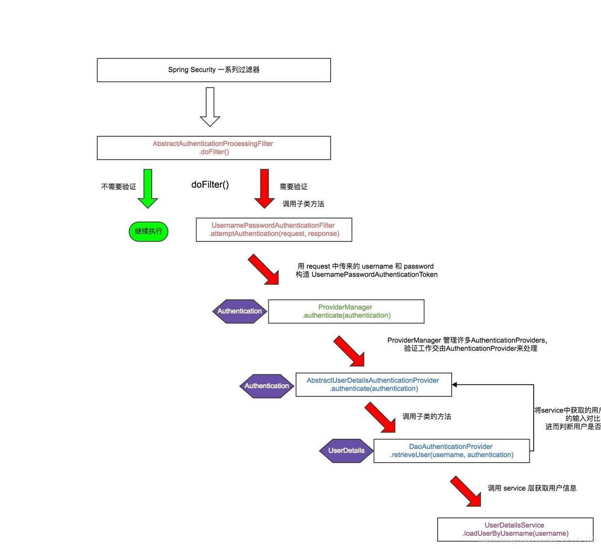

### Spring Security

参考：[黑马教程](https://www.bilibili.com/video/BV1EE411u7YV?p=2)  [Spring Security系列](https://blog.csdn.net/yuanlaijike/category_9283872.html) [配置方式](https://blog.csdn.net/fellhair/article/details/91410281) 




#### 认证

```java
public class JwtLoginFilter extends UsernamePasswordAuthenticationFilter {

    private AuthenticationManager authenticationManager;
    private RsaKeyProperties prop;

    public JwtLoginFilter(AuthenticationManager authenticationManager, RsaKeyProperties prop) {
        this.authenticationManager = authenticationManager;
        this.prop = prop;
    }

    public Authentication attemptAuthentication(HttpServletRequest request, HttpServletResponse response) throws AuthenticationException {
        try {
            SysUser sysUser = new ObjectMapper().readValue(request.getInputStream(), SysUser.class);
            UsernamePasswordAuthenticationToken authRequest = new UsernamePasswordAuthenticationToken(sysUser.getUsername(), sysUser.getPassword());
            return authenticationManager.authenticate(authRequest);
        }catch (Exception e){
            try {
                response.setContentType("application/json;charset=utf-8");
                response.setStatus(HttpServletResponse.SC_UNAUTHORIZED);
                PrintWriter out = response.getWriter();
                Map resultMap = new HashMap();
                resultMap.put("code", HttpServletResponse.SC_UNAUTHORIZED);
                resultMap.put("msg", "用户名或密码错误！");
                out.write(new ObjectMapper().writeValueAsString(resultMap));
                out.flush();
                out.close();
            }catch (Exception outEx){
                outEx.printStackTrace();
            }
            throw new RuntimeException(e);
        }
    }

    public void successfulAuthentication(HttpServletRequest request, HttpServletResponse response, FilterChain chain, Authentication authResult) throws IOException, ServletException {
        SysUser user = new SysUser();
        user.setUsername(authResult.getName());
        user.setRoles((List<SysRole>) authResult.getAuthorities());
        String token = JwtUtils.generateTokenExpireInMinutes(user, prop.getPrivateKey(), 24 * 60);
        response.addHeader("Authorization", "Bearer "+token);
        try {
            response.setContentType("application/json;charset=utf-8");
            response.setStatus(HttpServletResponse.SC_OK);
            PrintWriter out = response.getWriter();
            Map resultMap = new HashMap();
            resultMap.put("code", HttpServletResponse.SC_OK);
            resultMap.put("msg", "认证通过！");
            out.write(new ObjectMapper().writeValueAsString(resultMap));
            out.flush();
            out.close();
        }catch (Exception outEx){
            outEx.printStackTrace();
        }
    }

}

```


#### 授权

```java
public class JwtVerifyFilter extends BasicAuthenticationFilter {

    private RsaKeyProperties prop;

    public JwtVerifyFilter(AuthenticationManager authenticationManager, RsaKeyProperties prop) {
        super(authenticationManager);
        this.prop = prop;
    }

    public void doFilterInternal(HttpServletRequest request, HttpServletResponse response, FilterChain chain) throws IOException, ServletException {
        String header = request.getHeader("Authorization");
        if (header == null || !header.startsWith("Bearer ")) {
            //如果携带错误的token，则给用户提示请登录！
            chain.doFilter(request, response);
            response.setContentType("application/json;charset=utf-8");
            response.setStatus(HttpServletResponse.SC_FORBIDDEN);
            PrintWriter out = response.getWriter();
            Map resultMap = new HashMap();
            resultMap.put("code", HttpServletResponse.SC_FORBIDDEN);
            resultMap.put("msg", "请登录！");
            out.write(new ObjectMapper().writeValueAsString(resultMap));
            out.flush();
            out.close();
        } else {
            //如果携带了正确格式的token要先得到token
            String token = header.replace("Bearer ", "");
            //验证tken是否正确
            Payload<SysUser> payload = JwtUtils.getInfoFromToken(token, prop.getPublicKey(), SysUser.class);
            SysUser user = payload.getUserInfo();
            if(user!=null){
                UsernamePasswordAuthenticationToken authResult = new UsernamePasswordAuthenticationToken(user.getUsername(), null, user.getAuthorities());
                SecurityContextHolder.getContext().setAuthentication(authResult);
                chain.doFilter(request, response);
            }
        }
    }
}

```

